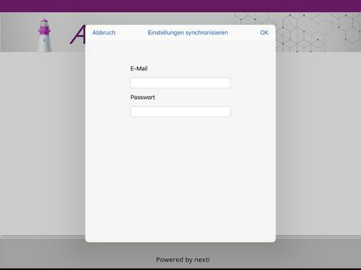
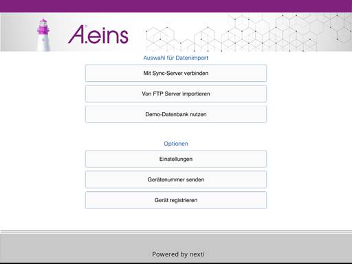

# Inbetriebnahme

<!-- source: https://amic.de/hilfe/inbetriebnahme.htm -->

Die App muss im Apple AppStore die APP auf das Endgerät zu installieren. Downloadlink: [https://apps.apple.com/de/app/a-eins/id1450152656](https://apps.apple.com/de/app/a-eins/id1450152656)

Sobald man im Portal freigeschaltet wurde, kann man das Gerät auf registrieren. Die Zugangsdaten dafür stellt der AMIC Support oder der zuständige Systemadministrator bereit. I.d.R bekommt man diese auf die Applemail.

