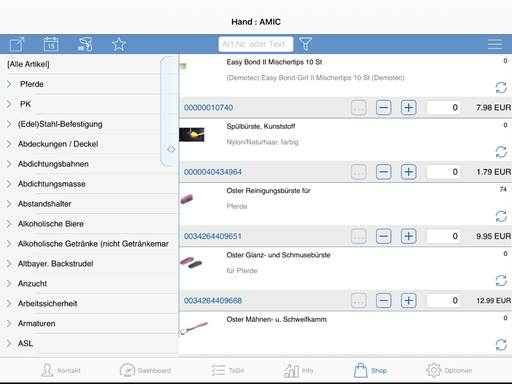
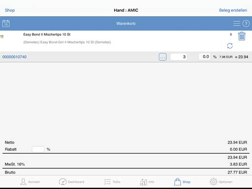

# Shop

<!-- source: https://amic.de/hilfe/shop.htm -->

Im Shop sind können die, in der A.eins Software existierenden Artikel, angezeigt werden.

Der Shop bietet die Möglichkeit vor Ort einen Auftrag für den Kunden zu erstellen. Hierfür wählt man den/die gewünschten Artikel, mit dem „Plus“-Symbol, aus und fügt diesen dem Warenkorb hinzu. Danach navigiert man in den Warenkorb um den Auftrag zu erstellen.

