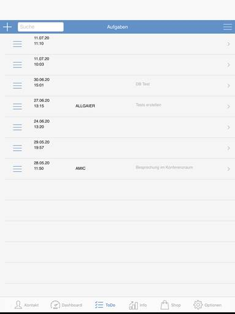

# To Do

<!-- source: https://amic.de/hilfe/todo.htm -->

Der Reiter „ToDo“ ist Benutzer bezogen. Hier können Planungsaufgaben erstellt werden. Diese sind dann auch in der A.eins-Software einzusehen.

