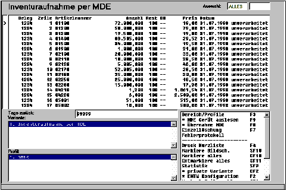
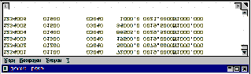
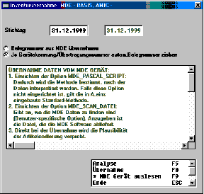

# Inventur / Mobile Datenerfassung MDE

<!-- source: https://amic.de/hilfe/inventurmobiledatenerfassungmd.htm -->

### Übersicht

Die Übernahme per MDE-Gerät wird im Fehlerprotokoll **[FEHLP]** protokolliert.

Ansicht MDE-Datei

### Inventuraufnahmen per mobiler Datenerfassung

Bei der mobilen Datenerfassung wird der Inventur-Stichtag zu einer Aufnahme nicht mitgeliefert. Es wird die älteste offene Inventur als Inventurstichtag vorbelegt, jedoch kann alternativ auch ein anderer Stichtag gewählt werden.

Falls aus der MDE ein Bewertungspreis übergeben wird, so gilt die Aufnahme als manuell bewertet.

### Löschen von Belegen der Mobilen Datenerfassung

Unverarbeitete Belege lassen sich nur über die Einzellöschung entfernen. Eine Sammel-Löschfunktion kann auf alle fehlerhaften bzw. verarbeiteten MDE Belege angewandt werden.

Auf Spezialitäten sei hier noch einmal hingewiesen:

Die MDE Schnittstelle enthält keine Mengen- oder Preisbezüge. Die Mengen werden in der vereinbarten Lager-Mengeneinheit erwartet, Bewertungspreise bezogen auf die EK-Preismengeneinheit und in dem für den Artikel vereinbarten Preisfaktor EK.

Die erforderlichen Optionen für die MDE Übernahme müssen eingerichtet sein.

Die MDE Übergabe erfolgt nicht nach Inventurgruppen getrennt. Die Inventurgruppen für die einzuspielenden Artikel müssen angelegt und eröffnet sein, ansonsten laufen diese Artikel ins Fehlerprotokoll.

### Inventuraufnahme in Filialen

Wenn nicht AMIC-Standards benutzt werden:

die Tabellen Inventurstamm, Inventurgruppe, Inventurbeleg replizieren, nicht aber Inventurbestand.

Zur Organisation: Inventurgruppen müssen filial-spezifisch abgegrenzt werden. Auf diese Weise wird sichergestellt, dass alle Betriebsstätten ihre eigenen Nummernkreise (Anlegen nicht vergessen) für Inventurbelege erhalten.

Filialen haben nur Zugriff auf die Anwendung „Inventuraufnahme **[IVA]**“.

Alternativ: Inventurbeleg nicht replizieren. Nach Fertigstellung der Aufnahme in den Filialen Tabelle entladen und in Zentrale beladen.

### Inventurbewertung

Die Bewertung der Inventur kann auf unterschiedlichen Ebenen erfolgen:

- Bei der Inventuraufnahme (Einstellung im Inventurstamm)
- Über den Menüpunkt Bewertungspreise mit Erfassung bzw. Kalkulation und Übernahme
- Innerhalb des Menüs Inventurbestand (Variante Zählbestand) über die Funktionen ***Einzelbewertung*** und ***autom. Bewertung***
