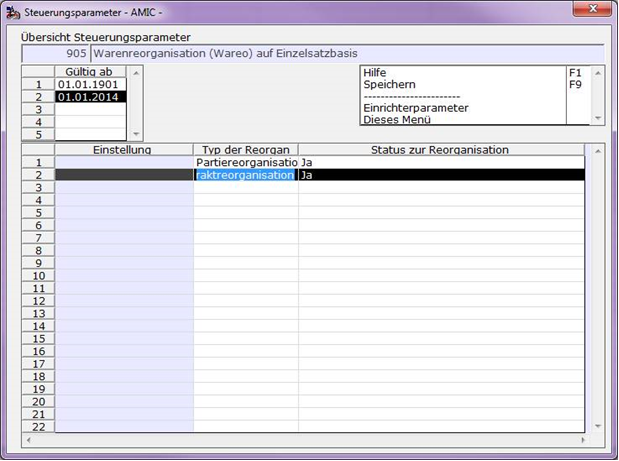
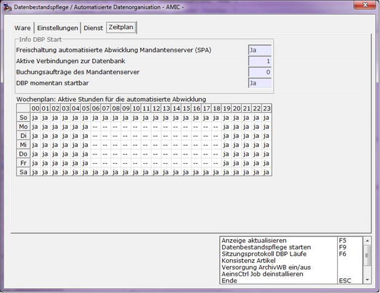

# Permanente Reorganisation

<!-- source: https://amic.de/hilfe/permanentereorganisation.htm -->

Die aktuell veränderten Artikel wurden ohne zusätzliche Einstellungen schon seit längerer Zeit protokolliert. Für die Aktivierung der Reorganisation von Kontrakten und Partien muss der SPA 905 angepasst werden:

Hinweis: Die Itembox zur Auswahl des Typs der Reorganisation weist eventuell noch die Option ‚Artikelreorganisation‘ aus. Die Einstellung ist nicht notwendig!

Ferner muss der SPA 628 ‚Datenbestandspflege im Mandantenserver‘ auf 1 gestellt sein. Hierdurch wird ein im Mandantenserver verankerter Prozess aktiviert, der die eigentliche Reorganisation der Objekte durchführt. Dieser Prozess prüft immer nachfolgenden Bedingungen ab, bevor die eigentliche Reorganisation durchgeführt wird:

Bin ich der einzige eingeloggte Benutzter im System?

Ist der Datenstrom leer?

Habe ich eine Erlaubnis vom Zeitschema?

Das Zeitschema wird mit dem Direktsprung DBP festgelegt:

Prinzipiell kann die automatisierte Abwicklung auch im laufenden Betrieb eingeschaltet werden. Die oben erwähnten Bedingungen treffen dann in der Regel nicht zu. Es macht aber Sinn, schon bekannte Zeiten andere Systeme (z.B. Datensicherung) auszuschließen.

ACHTUNG: zusätzlich zu ja/nein gibt es noch weiter Einstellung, kläre ich noch ab. Da geht es darum, ob DBP auch laufen darf, obwohl noch Benutzter im System sind!

In dieser Anwendung befinden sich zudem folgende nützliche Funktionen:

**Datenbestandspflege starten:**

Wenn alle oben erwähnten Bedingungen eingehalten sind kann man die Reorganisation auch direkt starten. Achtung: es gibt dafür keine Unterbrechung. Wenn man sich auf dem Mandanten dann parallele noch einmal einloggt, wird die Reorganisation sofort unterbrochen.

**Sitzungsprotokoll DBP Läufe:**

Jeder Lauf wird protokolliert. Hiermit kann man den Verlauf der Reorganisation nachvollziehen.

**Noch einige technische Hinweise:**

Die noch ausstehenden Artikelreorganisationen befinden sich in der Relation ArchivArtikelAuftrag.

Die noch ausstehenden Kontrakt- und Partiereorganisationen werden in der Relation WareoEinzelsatz festgehalten.
