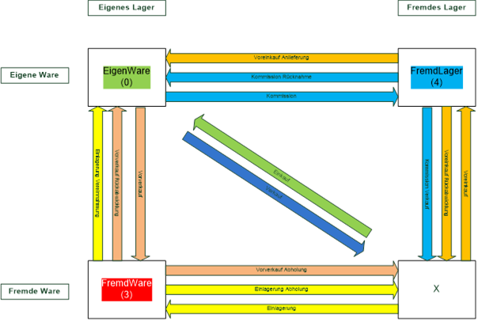

# Waren- Lager und Eigentumsbegriffe

<!-- source: https://amic.de/hilfe/warenlagerundeigentumsbegriffe.htm -->

Nicht jede Ware, die im Lager liegt gehört zur eigenen Ware und nicht alles, was einem selbst gehört, muss auch im eigenen Lager liegen. Dieser Abschnitt klärt Begriffe, die im Bereich der Lagerung verwendet werden.

Siehe auch:

- [Begriffsdefinitionen](./begriffsdefinitionen.md)
- [Vorgänge, die Waren bewegen](./vorgaenge_die_waren_bewegen.md)
- [Buchungstypen](./buchungstypen.md)
