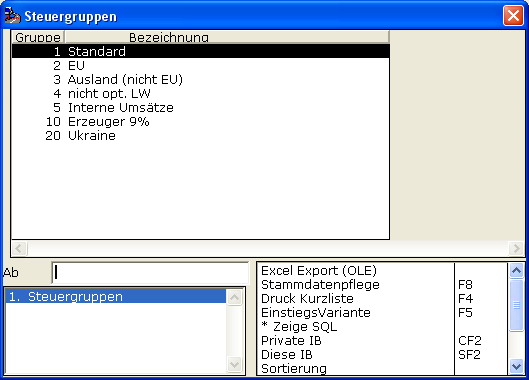

# Fehlermeldungen

<!-- source: https://amic.de/hilfe/_fehlermeldungen.htm -->

Verschiedene Arten der Fehlermeldung können erfolgen. So reagiert das System z.B. bei der Eingabe von Buchstaben in ein Feld, das eindeutig numerisch ist (z.B. das Mengeneingabefeld), mit einem **Piepton** und verlangt eine korrekte Eingabe.  
Bei Eingabe eines technisch korrekten, jedoch inhaltlich falschen Wertes (z.B. eine nicht vorhandene Steuergruppe), werden automatisch die zulässigen Alternativen angezeigt:

