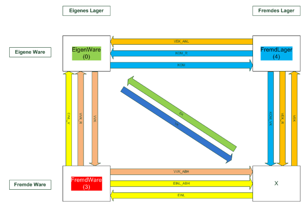

# Bestände / Bewertung

<!-- source: https://amic.de/hilfe/_bestndebewertung.htm -->

Der Artikel wird einer Inventurgruppe (s. dazu [Inventur](../../abschluesse_inventur/inventur/index.md)) sowie einer Bewertungsgruppe zur Bestimmung des Bewertungsverfahrens für die laufende Bewertung zugeordnet. Außerdem kann eine Inventurmengenabweichungsgruppe (s. dazu [Inventur](../../abschluesse_inventur/inventur/index.md)) zugeordnet werden.

| Bestandsinformation | Bedeutung |
| --- | --- |
| Eigenbestand | Der Eigenbestand weist den im Eigentum befindlichen Bestand aus. Der Wert ergibt sich aus dem physisch anwesenden Bestand abzüglich der Fremdware (eingelagerte Ware, vorverkaufte noch nicht ausgelieferte Ware) zuzüglich externer Bestände (ausgelagerte Ware bzw. Kommisionsware, voreingekaufte aber noch nicht angelieferte Ware). |
| Fremd-Bestand EK | Summe der externen Bestände (Fremdlager), die durch Voreinkaufsvorgänge entstanden sind und noch nicht angeliefert wurden. |
| Kommission/Auslagerung | Summe der externen Bestände (Fremdlager), die durch Auslagerung z.B. als Kommissionsware entstanden sind. |
| Ist-Bestand | Der physisch anwesende Bestand im eigenen Lager inclusive der Fremdware (eingelagerte Ware, vorverkaufte noch nicht ausgelieferte Ware). |
| Fremd-Bestand VK | Summe der Bestände (Fremdware), die durch Vorverkaufsvorgänge entstanden sind und noch nicht ausgeliefert wurden. |
| Einlagerungen | Summe der Bestände (Fremdware), die durch Einlagerung entstanden sind. |
| disponierter Bestand | Summe der bereits disponierten Mengen (z.B. durch bestehende noch nicht ausgeführte Aufträge). |

Die jeweils zugehörigen Korrekturmengen enthalten Mengen, die bereits in Vorgängen erfasst, aber noch nicht durch den Mandantenserver gebucht sind.

Neben der Anzeige der verschiedenen Bestandsinformationen können Soll-, Mindest- und Meldebestand sowie Bestellpoolangaben eingegeben werden (s. dazu [Bestellwesen](../../vorgangsabwicklung/bestellwesen/einrichtung/artikel_ar.md)). In Bestellungen wird daraus nach folgendem Algorithmus die zu bestellende Menge ermittelt:

Verfügbarer Bestand > Meldebestand: keine Bestellung

Verfügbarer Bestand &lt; Meldebestand: Bestellung = Sollbestand – verfügbare Menge

Die in Bestell-Vorgängen enthaltenen Mengen, die noch nicht geliefert wurden, werden ebenfalls ausgewiesen.

**Legende:**

ANL - Anlieferung

ABH - Abholung

EINL - Einlagerung

R - Rücknahme/Rückgabe

KOM - Kommission

VEK - Voreinkauf

VVK - Vorverkauf

EK - Einkauf

VK - Verkauf

EINL_V - Vereinnahmung
