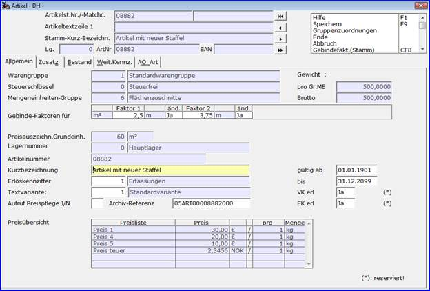

# Artikel

<!-- source: https://amic.de/hilfe/_artikelar.htm -->

Hauptmenü > Stammdatenpflege > Artikelstamm > Artikel

oder Direktsprung **[AR]**

Der Artikel ist die bebuchbare Einheit; i.d.R. das Verkaufsprodukt in einem Lager bei Mehrlagerverwaltung; im Einlagerfall das Verkaufsprodukt. Im letzten Fall hat sicher­lich die Trennung zwischen Artikelstamm und Artikel wenig Relevanz. Hier ist von Fall zu Fall zu entscheiden, ob die Erfassung der Artikel ausschließlich über den Be­reich Artikel oder den Einstieg Artikelstamm erfolgen sollte. Der Ablauf entspricht dann dem beim Artikelstamm beschriebenen und wird automatisch ausgelöst, wenn A.eins bei der Neuerfassung des Artikels feststellt, dass noch kein Artikelstamm vorhanden ist.

Da viele Merkmale, wie Preise, Zuordnung zu Kostenstellen, etc. lagerabhängig sein können, werden solche Größen am Artikel festgemacht.

Alles, was in verschiedenen Lagern unterschiedlich sein **KÖNNTE**, muss im Artikel hinterlegt werden!

Dies schafft die Möglichkeit, in einem Artikelstammsatz mehrere Varianten zu führen

Stellt A.eins bei der Neuanlage fest, dass der Artikelstamm vorhanden ist, werden noch die Informationen, die für eine Ausprägung wichtig sind, abgefragt.

Zuerst wird deshalb bei der Neuanlage nach der Artikelstammnummer gefragt. Ist sie nicht vorhanden wird darauf hingewiesen und die Anlage des Artikelstamms ermög­licht.

Der dabei beteiligte obere Teil des Eingabebildschirms ist identisch mit dem des Artikelstamms.

Ist sie vorhanden, verzweigt A.eins auf die Erfassung der Ausprägung: im mittleren Bereich des Bildschirms

Folgenden Funktionen kommen hierbei zum Einsatz.

Unveränderbar werden aus dem Artikelstamm die Felder der oberen Hälfte über­nommen; vorbelegt aus dem Artikelstamm aber überschreibbar sind die Felder Arti­kel­nummer, Kurzbezeichnung und Erlöskennziffer.  
Eine Besonderheit ist bei der Erlöskennziffer zu beachten: Ist diese im Artikel mit dem Wert **‚0‘** belegt, so wird bei der Verwendung des Artikels in Vorgängen die Erlöskennziffer des zugehörigen Artikelstamms herangezogen. Dieses wird dadurch verdeutlicht, dass im zugehörigen Bezeichnungsfeld die Angabe <strong>‚aus Artikelstamm: </strong><em>n</em><strong>‘ </strong>mit n = Erlöskennziffer des Artikelstamms dargestellt wird.

Die Lagernummer wird aus den Vorgangskonstanten **[VKONS]** vorbelegt und das Gültigkeitsdatum hat eine Stan­dard­vorbelegung.

Besonders zu beachten sind die Felder des Grids ‚Gebinde-Faktoren für‘, in denen gegebenenfalls die Faktoren des ‚Standardgebindes‘ des Artikels/Artikelstamms gepflegt werden können. Um diese Pflegeoption nutzen zu können, muss der Steuerparameter ‚ Standardgebindefaktoren auf Artikelmaske (SPA 764)‘ über die Einstallung ‚Ja‘ verfügen: Sind in der dem Artikelstamm des Artikels zugeordneten Mengeneinheitsgruppe die Mengeneinheiten für Verkauf und Einkauf identisch und vom Typ Gebinde, so bewirkt die Einstellung ‚Ja‘ dieses Steuerparameters, dass die Gebinde-Faktoren jener Gebinde-Mengeneinheit auf der Artikel-Bearbeitungsmaske angezeigt und, in Abhängigkeit von der im Gebinde-Stamm eingestellten Herkunft der Faktoren, auch erfasst bzw. geändert werden können. Ist die Faktor-Herkunft mit ‚aus Mengeneinheit‘ angegeben, so können diese hier nicht geändert werden. Bei der Einstellung ‚aus Artikelstamm‘ ist eine Erfassung nur bei der Anlage eines neuen Artikelstammsatzes möglich. Bei eingestellter Variante ‚aus dem Artikel‘ können die Faktoren hier auch im Änderungs-Modus bearbeitet werden. Die hier angegeben Faktoren gelten dann für alle Bereiche (Einkauf, Verkauf und Lager) und werden entsprechend in den Relationen für Artikel-Gebinde-Faktoren bzw. Artikelstamm-Gebinde-Faktoren eingetragen.

In Abhängigkeit von der Einsatztiefe sind weitere Parametergruppen zu pflegen.

Siehe auch:

- [Registerkarte Allgemein](./registerkarte_allgemein.md)
- [Registerkarte Bestand](./registerkarte_bestand.md)
- [Listenpreise Verkauf und Einkauf](./listenpreise_verkauf_und_einkauf.md)
- [Gruppenzuordnungen](./gruppenzuordnungen.md)
- [Bestände / Bewertung](./bestaende_bewertung.md)
- [Weitere Kennzeichen](./weitere_kennzeichen.md)
- [Registerkarte Markt](./registerkarte_markt.md)
- [Gruppenzuordnung:](./gruppenzuordnung.md)
- [Zu- / Abschläge Verkauf und Einkauf](./zu_abschlaege_verkauf_und_einkauf.md)
- [Artikel-Bemerkungen](./artikel_bemerkungen.md)
- [Kostenstellen / Statistik / Abteilung](./kostenstellen_statistik_abteilung.md)
- [Artikel löschen](./artikel_loeschen.md)
