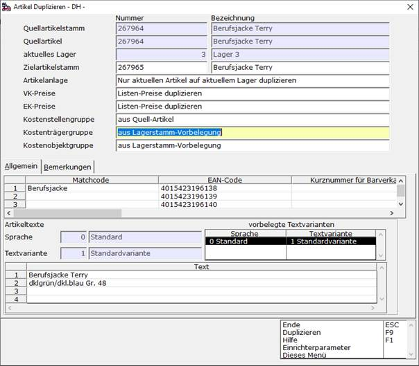

# Artikelstamm duplizieren

<!-- source: https://amic.de/hilfe/_artikelduplizierer.htm -->

Hauptmenü > Stammdatenpflege > Artikelstamm > Artikel > Duplizieren

Direktsprung **[AR]**

Mit der Funktion ***Duplizieren*** können die zu den in der Auswahlliste markierten Artikeln gehörenden Artikelstamm-Einträge mit dem jeweils ausgewählten oder allen zugehörigen Artikeln unter Vergabe einer neuen Artikelstammnummer dupliziert werden.

Zunächst wird im Feld **Zielartikelstamm** die neue Artikelstamm-/Artikelnummer und im Feld **Bezeichnung** die neue Artikelstamm-/Artikelbezeichnung angegeben. Das Feld **Artikelanlage** dient zur Festlegung, ob nur der ausgewählte Artikel oder alle zum Quell-Artikelstamm existierenden Artikel kopiert werden sollen. Die Einstellungen in den Feldern **VK-Preise** und **EK-Preise** geben an, ob die jeweiligen Listenpreise im Verkauf beziehungsweise Einkauf ebenfalls zu duplizieren sind.  
Die eingerichteten Sekundärschlüssel wie Matchcode und EAN-Code können in der Datentabelle **Allgemein**, Artikelstamm-Bemerkung und Artikel-Bemerkung in der Datentabelle **Bemerkungen** angepasst werden. Zur Anpassung der Artikeltexte in allen zum Quell-Artikelstamm gefundenen Sprachen und Textvarianten gibt es den Bereich **Artikeltexte**.  
Bezüglich der K**ostenstellengruppe**, **Kostenträgergruppe** und **Kostenobjektgruppe** kann jwewils festgelegt werden, ob der Wert für die neuen Artikel aus dem Quell-Artikel oder aus den jeweiligen Einträgen des Lagerstamms entnommen werden soll. Diese Felder sind nur dann verfügbar, wenn die zugehörigen Steuerparameter **Kostenstellen-Lizenz**, **Kostenträgerrechnung angeschlossen** beziehungsweise **Kostenobjekt-Lizenz** aktiviert sind.  
Die änderbaren Daten sind aus dem jeweiligen Quell-Artikelstamm und Quell-Artikel vorbelegt.

Nachdem der Artikelstamm und der beziehungsweise die Artikel dupliziert wurden, kann mit den Funktionen ***Neuen Artikelstamm ändern*** und ***Neue Artikel ändern*** das jeweilige Pflegemodul zum Ändern des Artikelstamms und des oder der Artikel aufgerufen werden, um zusätzliche Korrekturen der neuen Stammdaten vorzunehmen.
