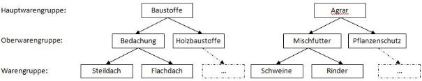
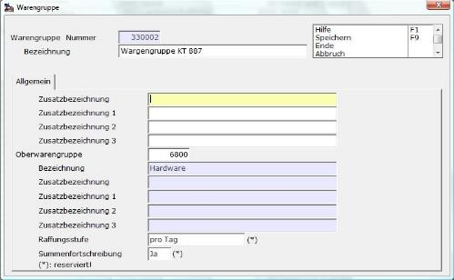
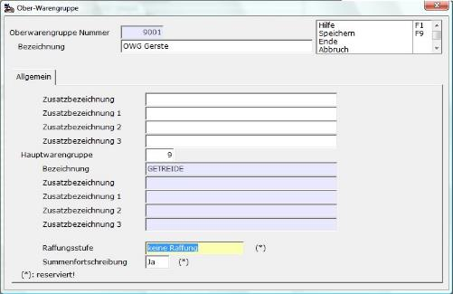
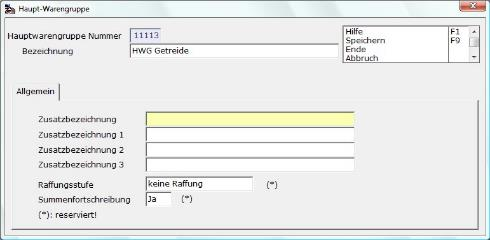

# Hauptwarengruppen / Oberwarengruppen / Warengruppen

<!-- source: https://amic.de/hilfe/_hauptwarengruppenobe.htm -->

Warengruppen dienen der inhaltlichen Gliederung des Artikelstamms in Auswer­tun­gen und Selektionen. In A.eins ist ein dreistufiges hierarchisches Waren­gruppenkonzept realisiert worden, das sowohl schrittweise verdichtende oder auf­lösen­de Analysen des Waren­ge­schäf­tes zulässt, als auch die Betrachtung der Einzelebenen.  
Die Ebenen werden bezeichnet mit:

**Hauptwarengruppe**

**Oberwarengruppe**

**Warengruppe**

Die Beziehungen zwischen den Ebenen sind eindeutig, d.h., ein Artikel ist eindeutig einer Warengruppe zugeordnet, diese einer Oberwarengruppe und diese einer Haupt­­warengruppe. Aus dieser Struktur heraus ergibt sich, dass die Erfassung in der Reihenfolge Hauptwarengruppe, Oberwarengruppe, Warengruppe erfolgt.  
Der Erfassungsablauf ist jeweils gleich, nur dass bei der Oberwaren- und Waren­gruppenerfassung die jeweils zugehörige Haupt- bzw. Oberwarengruppe anzugeben ist  
Es ist möglich, auf das Warengruppensystem ganz oder in der Anfangsphase der Installation zu verzichten (Eintrag WG 0 im Artikelstamm) und später nachzutragen; dementsprechend sind auch Änderungen möglich.

Ein Beispiel für die Warengruppenstaffelung könnte sein:

Innerhalb der Warengruppeneingabe / -änderung stehen nachfolgende Felder zur Verfügung.

Nach Vergabe der Warengruppennummer sind die Bezeichnung und die Zuordnung zur Oberwarengruppe einzugeben. Die Felder Raffungsstufe und Summenfortschreibung sind für spätere Erweiterungen reserviert.

Nach Anlegen des Warengruppenkonzeptes werden die Warengruppen bei der Artikelstammerfassung den Artikeln zugeordnet.

Maske zur Erfassung / Änderung der Oberwarengruppe.

Maske zur Erfassung / Änderung der Hauptwarengruppe.

