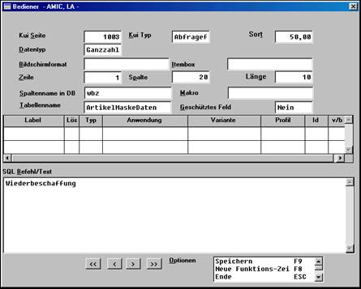
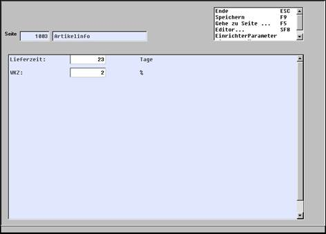

# Dynamisches Informationssystem (Artikel)

<!-- source: https://amic.de/hilfe/_dynamischesinformati.htm -->

Ein dynamisches Informationssystem kann folgende Informationen enthalten:

- Daten, die direkt aus dem operativen System gelesen werden (VK-Umsatz, EK-Umsatz, Auftragsbestand, Bestand)
- Daten, die im Artikelinformationssystem erfasst werden: Lieferzeit, Einsatz­men­gen, etc.
- Beschreibende Texte, wie Verwendungszweck, etc.

Nachfolgend wird die Einrichtung dieser Informationen beschrieben.

**Beispiel:** Einrichtung von Abfragefeldern

Auf der KUI - Seite 1003

Wird der Kui Typ Abfragefeld bestimmt

Die Darstellung erfolgt ganzzahlig

Das in Zeile 1, Spalte 15 mit der Länge 10 angezeigt wird

In der Relation "ArtikelMaskeDaten" ist dies das Feld "wbz"

Die Bezeichnung in der Erfassungsmaske ist "Wiederbeschaffung:"

Die Darstellung erfolgt dann folgendermaßen:

