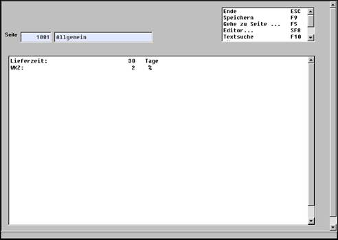

# Einrichtung als Notizblatt (Artikel)

<!-- source: https://amic.de/hilfe/_einrichtungalsnotizb.htm -->

Mit Aufruf wird immer die erste Seite angeboten. **F8** ermöglicht die Einrichtung einer neuen Seite. Nach Vergabe einer Seitennummer (im Artikelinformationssystem sind es die Seiten 1000-1999) wird dieser Seite ein Name vergeben und die somit eingerichtete Seite mit **F9** gespeichert. Manuelle Einträge können jetzt direkt in das Textfeld eingetragen werden. Eleganter jedoch ist der Aufruf des Texteditors, da hier einfache Textbearbeitungsmöglichkeiten angeboten werden. In der Ansicht erhält man z.B. folgende Darstellung:

