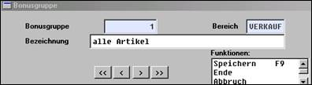

# Parameter der Bonusabwicklung

<!-- source: https://amic.de/hilfe/_parameterderbonusabw.htm -->

Hauptmenü > Stammdatenpflege > Konstanten Artikelstamm > Bonusgruppen / Bonusklassen / Artikel-Bonus-Sätze

A.eins ist auf die Umsetzung von Bonusabrechnungen vorbereitet. Die Stammdaten werden innerhalb der Artikelkonstanten verwaltet. Es handelt sich dabei um:

- Bonusgruppen **[BOG]**, die die Zuordnung der Artikel bestimmen
- Bonusklassen **[BOKL]**, die die Zuordnung der Kunden bestimmen
- Bonussätze **[ARBO]**, die das Abrechnungsverfahren bestimmen

Z.Z. sind weitergehende Abwicklungsverfahren nicht implementiert; nachfolgend wird deshalb lediglich das vorgesehen Verfahren beschrieben.

Innerhalb von A.eins können Kunden Bonusklassen zugeordnet werden. Hierbei kann es "beliebig" viele Bonusklassen geben, denen die Kunden für die Bonusermittlung zugeordnet werden.

Diese Bonusklassen können mit einem Sperrkennzeichen versehen werden, das (temporär) den Bonus für alle Kunden bzw. Lieferanten der Bonusklasse sperrt.

Hierzu müssen folgende Felder erfasst werden.

**Bonusklasse:**

Identifikation der Bonusklasse.

**Bezeichnung:**

Bezeichnung der Bonusklasse für Auswahllisten etc.

**Sperrkennzeichen:**

Sperrkennzeichen, das (temporär) den Bonus für alle Kunden bzw. Lieferanten der Bonusklasse sperrt.

Die Artikel werden Bonusgruppen zugeordnet:

Ebenso können die Boni nach Zeiträumen der Gültigkeit erfasst werden.

Im Eingabebildschirm zum Artikelbonussatz können die nachfolgenden Felder bearbeitet werden.

**Bonusklasse:**

Identifikation Nummer und Text der Bonusklasse der Bonusklasse

**Bonusgruppe:**

Identifikation der Bonusgruppe.

**Ab Datum:**

Erster Tag der Gültigkeit. Datum auf das die Einträge bezogen sind

**Bis Datum:**

Letzter Tag der Gültigkeit.

**Formel:**

Art und Weise, wie sich der Bonusbetrag errechnet:

1 = prozentual vom Warenwert abzüglich Rabatte

2 = prozentual vom reinen Warenwert

11 = Rabattsatz je Mengeneinheit

12 = Rabattsatz je Grundeinheit

**Prozent:**

Bonussatz bei prozentualer Berechnung.

**Preis:**

Beschreibung Bonussatz bei preisähnlicher Bonusermittlung
