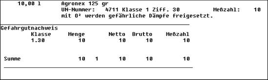
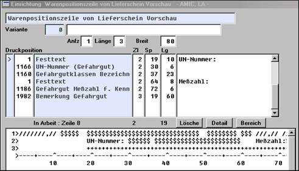
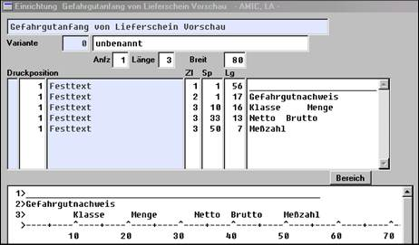
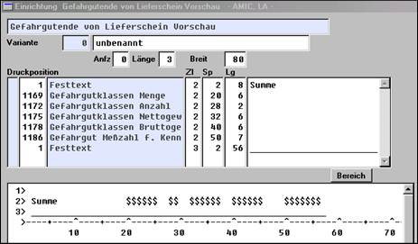
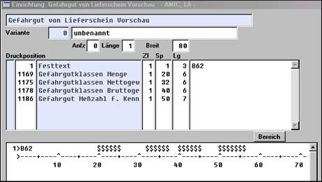

# Gefahrgut im Vorgang

<!-- source: https://amic.de/hilfe/_gefahrgutimvorgang.htm -->

Es ist gesetzlich vorgeschrieben, beim Transport von Gefahrgütern Informationen über Art und Umfang mitzuführen. Zudem dürfen der Umfang und die Kombination vorgeschriebene Höchstgrenzen nicht übersteigen. A.eins ermöglicht, z.B. folgende Information automatisch auszugeben:

Um diese Daten ausgeben zu können ist das zugrunde liegende Formular entsprechend einzurichten.

Die Warenpositionszeile (Bereich 101)

Für die Zusammenfassung aller Gefahrgutinformationen im Vorgang sind die Be­reiche 60,61,62 anzulegen.

Der Gefahrgutnachweis ist in allen Vorgangsklassen möglich; nachfolgend ist das Beispiel Lieferschein wiedergegeben.

