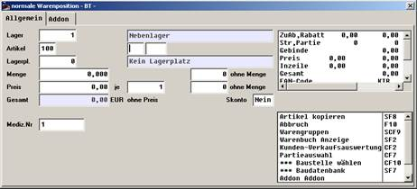

# Artikeleingabe in der Vorgangserfassung

<!-- source: https://amic.de/hilfe/_artikeleingabeinderv.htm -->

Bei der Vorgangserfassung kann nun der Basisartikel angegeben werden, automatisch ändert sich die Erfassungsmaske, und es werden noch weitere Felder, je nachdem wie viele [Merkmale](./festlegung_der_artikelnummernstruktur.md) eingerichtet sind, abgefragt.

Nach Eingabe der Basisartikelnummer werden im obigen Beispiel zwei neue Felder bereitgestellt, und es wird die Artikelnummer auf die in der Merkmalsleiste festgelegte Länge gekürzt.

Die neuen Felder sind mit den entsprechenden Auswahlboxen versehen, so dass eine bequeme Eingabe und Überprüfung möglich ist.

Nach Eingabe der beiden Merkmalsfelder wechselt die Maske wieder zurück auf die Originaldarstellung, und es wird die neu zusammengesetzte Artikelbezeichnung angezeigt, und es kann eine Fakturierung auf diesen Artikel vorgenommen werden.

Ist dieser Artikel noch nicht im System vorhanden, so wird eine kurze Hinweismeldung ausgegeben, und der Artikel wird angelegt.

Ist der Artikel im System wird er wie gewohnt bereitgestellt, es ist auch nicht notwendig die einzelnen Artikelnummern sich zu merken, es kann per Basisartikel incl. Eingabe der einzelnen Artikelnummernpositionen der gewünschte Artikel angesprochen werden.

Die Neu-Anlage der per Merkmalsleiste verarbeiteten Artikel kann durch passende Angabe eines [Einrichterparameters](../../firmenstamm/einrichterparameter/maskentitel_epa_svware.md) auch in allen Läger oder in ausgewählten Lägern des Systems vorgenommen werden. Zusätzlich besteht die Möglichkeit per individueller Regel die Neuanlage der Artikel zu beeinflussen.
