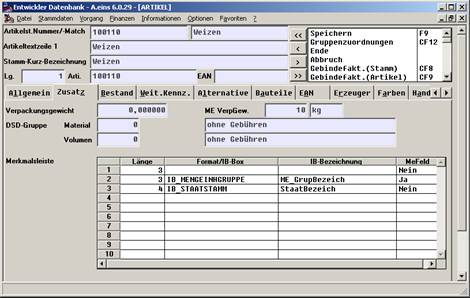

# Festlegung der Artikelnummernstruktur

<!-- source: https://amic.de/hilfe/_festlegungderartikel.htm -->

Innerhalb des Artikelpflegers kann eine Artikelnummernstruktur für den Warenerfassungsteil vorgegeben werden. Zur genauen Festlegung dieser Struktur muss angegeben werden, wie lang jeder einzelne Teil einer Artikelnummer sein soll, mit welcher Itembox dieser Teil überprüft werden soll, welcher Textersetzungsteil aus der Überprüfungsmechanik in den Artikeltext übernommen werden soll, und ob ggf. ein Teil dieser Nummer die Mengeneinheitsgruppe steuern soll.

Die Eingabemaske sieht wie folgt aus:

In diesem Beispiel wird die Artikelnummer aus 3 Teilen zusammengesetzt, und zwar einem festen Anteil von 3 Stellen der Basisartikelnummer ( den ersten drei Stellen ), von einem weiteren dreistelligen Teil der die Mengeneinheitsgruppe darstellt und einem abschließenden 4stelligen Teil, in dem das Herkunftsland verschlüsselt ist.

Die Artikelbezeichnung dieses Artikels setzt sich zusammen aus der Artikelbezeichnung des Basisartikels, aus der Mengeneinheitsgruppenbezeichnung und aus der Staatsbezeichnung (die einzelnen Blöcke werden jeweils durch einen Bindestrich voneinander getrennt).

Im obigen Beispiel ist das zweite Feld gekennzeichnet als ein Mengeneinheitsgruppenfeld, was zu Folge hat, dass bei der Neuanlage des Artikelstamms sofort diese Mengeneinheitsgruppe in den neuen Artikel eingetragen wird. Der Verkaufspreis wird entsprechend mit der Mengeneinheit VK dieser Gruppe vorbelegt.

Die Merkmalsleiste kann nur bis zu 8 Merkmale pro Artikelnummer spezifizieren.
