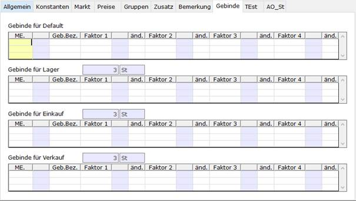

# Registerkarte Gebinde

<!-- source: https://amic.de/hilfe/_gebindefaktoren.htm -->

Wenn in der Mengeneinheit (Gebinde) eingetragen wurde, dass die Gebinde­ein­hei­ten im Artikelstamm und/oder Artikel abgelegt sind, dann ist hier eine Eintragung möglich:

Dies sollte immer erfolgen, wenn Gebindefaktoren unterschiedlich sind, es sich jedoch immer um die gleiche Gebindeformel handelt. Die Gebindefaktoren werden für die Bestandsführung (Lager), Einkauf und Verkauf abgelegt. Es sind jeweils mehrere unterschiedliche Faktoren je Mengeneinheit möglich: Eine Bestandsführung und die Preisführung könnte in cbm erfolgen, die Volumenermittlung jedoch auf unterschiedlichen Standardmaßen beruhen!
