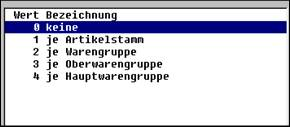

# Steuerungsparameter für Artikelstamm und Artikel

<!-- source: https://amic.de/hilfe/_steuerungsparameterf.htm -->

In den Steuerungsparametern können zentrale Grundeinstellungen für Artikelstamm und Artikel vorgenommen werden. Die wesentlichen finden sich in den Abschnitten 21 und 22, auf die hier eingegangen werden soll.

**Artikel – Stammdaten (Parametergruppe 21)**

**Länge Artikelstamm- und Artikelnummer:  
Hiermit wird die maximale Länge der Nummern bestimmt.**

**Variante Artikelnummer:**

**Gültigkeit ab:**  
Der Beginn der Gültigkeitsdauer kann sein:

1.1.1901

1.1. des laufenden Kalenderjahres

Beginn des laufenden Geschäftsjahres

**Gültigkeit bis:**  
Die Gültigkeit läuft ab

Am 31.12.2099

31.12. des laufenden Kalenderjahres

Ende des laufenden Geschäftsjahres

**Artikelstamm prüfen:**

Bei Eingabe von Ja werden die Artikelstammdaten bei der Einspielung überprüft.

**Standard Mengeneinheit Gewichte:  
Die Mengeneinheit für das Ver­packungsgewicht im Artikelstamm wird entsprechend dieser Eintragung vorbelegt.**

**Preiseinheit und Mengeneinheit fix je Artikel:**

**Autom. Verpackungs- / Bruttogewicht:**

Ohne:  
Netto-, Verpackungs- und Bruttogewicht werden manuell erfasst

Verpackung ergibt sich automatisch aus Brutto und Netto  
Brutto  
ergibt sich automatisch aus Netto und Verpackung

**Preisanzeigefenster mit 0-Preisen**

Dieser Parameter gibt an. Ob Preise mit dem Wert 0 auf der Hauptseite sichtbar sind.

**Preise im Anzeigenfenster**  
Dieser Parameter gibt an, welche Preise im Anzeigefenster dargestellt werden können.

**Aut. Artikel-Neuanlage bei Warenpos.**  
Wenn dieser Parameter gesetzt ist, so können Artikel, die in dem aktuellen Lager nicht angelegt ist mit der Funktion Artikelkopierer aus der Funktionsbox in das aktuelle Lager kopiert werden.

Mit einer Option kann auch ein Lager als Sortimentslager angegeben werden von dem dann in einem solchen Fall die Artikel kopiert werden.

**Dienstleistungen nur als Wertartikel**

Wenn dieser Parameter gesetzt ist, werden nur die Werte geführt, es werden keine Mengen geführt.

**Vorgangs-Nr. in Artikel-Info ab Stelle**

**Folgeartikel aktiv**

Hier kann die Folgeartikelfunktionalität ein bzw. ausgeschaltet werden.

**Variante Partiegruppe bei Saatgut**

Ist dieser Parameter gesetzt, so wird Artikelstamm eine eigene Partiegruppe vorbelegt.

Partiegruppe änderbar bei Saatgut

Wenn dieser Parameter gesetzt ist, dann ist eine Erfassung aber keine Änderung der Partiegruppe möglich.

Artikel – Vorbelegungen (Parametergruppe 22)

Rabatt- / Zu-/Abschlags-, Fracht-, Lade- und Bonusgruppen können hier für die Erfassung vorbelegt werden. Dabei sind folgende Einstellungen möglich:

Für das Beispiel 2: Warengruppe heißt dies z.B., dass die Warengruppennummer obige Felder bei der Neuerfassung vorbelegt. Alle Artikel einer Warengruppe haben dann z.B. die gleiche Rabattgruppe. Natürlich kann die Vorbelegung übersteuert werden; sie wird auch nicht nachträglich wirksam.
