# Die Auswahlliste Formulararchiv-Anzeige

<!-- source: https://amic.de/hilfe/dieauswahllisteformulararchiva.htm -->

Diese Auswahlliste wird nach Auslösen der Aktion ["Archiv anzeigen"](../index.md#aktion_archiv_anzeigen) geöffnet.

#### Archiv-Anzeige ohne Vorschau

Die Felder sind mittels ["Variante"](../../../archiv_import/archiv_dokumenten_import.md#archiv_ansichts_definition_variante) in den [Archiv-Ansicht-Definitionen](../../archiv_ansicht_definition/index.md) gegebenen Möglichkeiten einzurichten.

Die Felder in der Standard-Auslieferung der Archiv-Anzeige ohne Vorschau sind wie folgt:

<div class="table-wrapper">
  <table>
    <tbody>
      <tr>
        <td colspan="2">
          <p><b>Felder</b></p>
        </td>
      </tr>
      <tr>
        <td>
          <p>KndNr</p>
        </td>
        <td>
          <p>Zugeordnete Kundennummer</p>
        </td>
      </tr>
      <tr>
        <td>
          <p>Beleg-Typ</p>
        </td>
        <td>
          <p>Zugeordneter Textueller Beleg-Typ</p>
        </td>
      </tr>
      <tr>
        <td>
          <p>Beleg-Nr</p>
        </td>
        <td>
          <p>Zugeordnete Belegnummer</p>
        </td>
      </tr>
      <tr>
        <td>
          <p>Beleg-Datum</p>
        </td>
        <td>
          <p>Zugeordnetes Beleg-Datum</p>
        </td>
      </tr>
      <tr>
        <td>
          <p>Archiv/Druck-Datum</p>
        </td>
        <td>
          <p>Zugeordnetes Archivierungsdatum bzw. Druck-Datum</p>
        </td>
      </tr>
      <tr>
        <td>
          <p>Beleg-Referenz</p>
        </td>
        <td>
          <p>Zugeordnete Archiv-Referenz</p>
        </td>
      </tr>
      <tr>
        <td>
          <p>Mnd</p>
        </td>
        <td>
          <p>Zugeordneter Mandant</p>
        </td>
      </tr>
      <tr>
        <td>
          <p>Herkunft</p>
        </td>
        <td>
          <p>Zugeordnete Herkunft</p>
        </td>
      </tr>
      <tr>
        <td>
          <p>Betreff</p>
        </td>
        <td>
          <p>Zugeordneter Betreff</p>
        </td>
      </tr>
      <tr>
        <td>
          <p>Autor</p>
        </td>
        <td>
          <p>Zugeordneter Autor</p>
        </td>
      </tr>
      <tr>
        <td>
          <p>Barcode</p>
        </td>
        <td>
          <p>Zugeordneter Barcode</p>
        </td>
      </tr>
      <tr>
        <td>
          <p>Bedienerklasse</p>
        </td>
        <td>
          <p>Zugeordnete Bedienerklasse</p>
        </td>
      </tr>
      <tr>
        <td>
          <p>Formularid</p>
        </td>
        <td>
          <p>Zugeordnete Formularid</p>
        </td>
      </tr>
      <tr>
        <td>
          <p>Fa-Id</p>
        </td>
        <td>
          <p>Zugewiesene technische Formulararchiv-Id</p>
        </td>
      </tr>
      <tr>
        <td>
          <p>Dateiname</p>
        </td>
        <td>
          <p>Zugewiesener Dateiname</p>
        </td>
      </tr>
    </tbody>
  </table>
</div>

<div class="table-wrapper">
  <table>
    <tbody>
      <tr>
        <td colspan="2">
          <p><b>Funktionen</b></p>
        </td>
      </tr>
      <tr>
        <td>
          <p>Senden an …</p>
        </td>
        <td>
          <p>Senden an</p>
        </td>
      </tr>
      <tr>
        <td>
          <p>Archiv anzeigen [<b>Strg F12</b>]</p>
        </td>
        <td>
          <p>Archiv anzeigen</p>
        </td>
      </tr>
      <tr>
        <td>
          <p>Ändern</p>
        </td>
        <td>
          <p><a href="../../../archiv_stammdatenpfleger.md">Archiv-Stammdatenpfleger</a></p>
        </td>
      </tr>
      <tr>
        <td>
          <p>Ansehen</p>
        </td>
        <td>
          <p><a href="../../../archiv_stammdatenpfleger.md">Archiv-Stammdatenpfleger</a></p>
        </td>
      </tr>
      <tr>
        <td>
          <p>Hinzufügen</p>
        </td>
        <td>
          <p><a href="../../../archiv_dokumente_hinzufuegen.md">Archiv – Dokumente hinzufügen</a></p>
        </td>
      </tr>
      <tr>
        <td>
          <p>Barcode zuweisen …</p>
        </td>
        <td>
          <p><a href="../../../archiv_barcode.md">Archiv Barcode</a></p>
        </td>
      </tr>
      <tr>
        <td>
          <p>Drucken</p>
        </td>
        <td>
          <p>Es wird ein Druck des Archiv-Inhaltes über das Windows-System eingeleitet.</p>
          <p>Technische Erläuterung:</p>
          <p>Dabei wird von A.eins eine temporäre Datei im Temp-Verzeichnis erstellt und diese dem Windows-System zum Drucken über die Methode „print“ übergeben.</p>
          <p>Über Systemsteuerung &gt; Programme &gt; Standardprogramme können Sie mittels 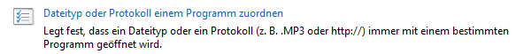</p>
          <p>auf Ihrem System nachverfolgen welche Applikation mit der Extension verbunden ist.</p>
        </td>
      </tr>
      <tr>
        <td>
          <p>Ansicht Information</p>
        </td>
        <td>
          <p>Diese Funktion teilt in einem Dialog mit, welche <a href="../../archiv_ansicht_definition/index.md">Archiv-Ansicht-Definition</a> zum Aufbau dieser Auswahlliste verwendet wurde.</p>
        </td>
      </tr>
      <tr>
        <td>
          <p>Archiv Eintrag löschen</p>
        </td>
        <td>
          <p><a href="../../../archiv_administration/index.md">Archiveinträge löschen</a></p>
        </td>
      </tr>
    </tbody>
  </table>
</div>

#### Neue Archiv-Anzeige mit Vorschau

Ist für die Ansicht der „Vorschau“-Modus aktiviert, dann gestaltet sich die „Archiv-Anzeige“ als Dialog in neuer Optik mit neuen Möglichkeiten:

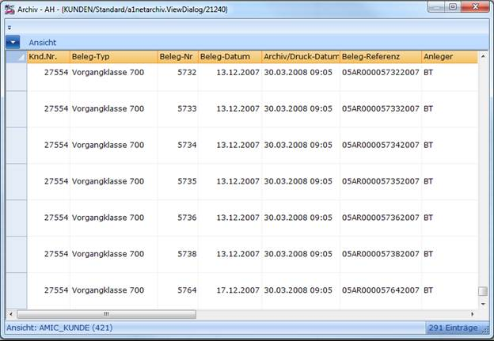

1) Der Dialog ist in der Größe veränderbar und auch insgesamt maximierbar.

2) Im Grid werden die bekannten Archiv-Inhalte dargestellt.

3) Im oberen Bereich befindet sich eine „Multifunktionsleiste“ (Ribboncontrol) das „Office-like“ neben dem Kontext-Menü (rechte Maustaste) ausgewählte Funktionalitäten zur Verfügung stellt. In der jetzigen Auslieferung ist das vorerst die Funktionalität ***Ansicht***.

   Über 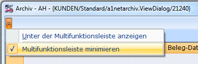 lässt sich die „Multifunktionsliste“ dauerhaft aufklappen, ansonsten muss mit der Maus der Punkt „Ansicht“ selektiert werden. Damit erhält man folgende Ansicht

   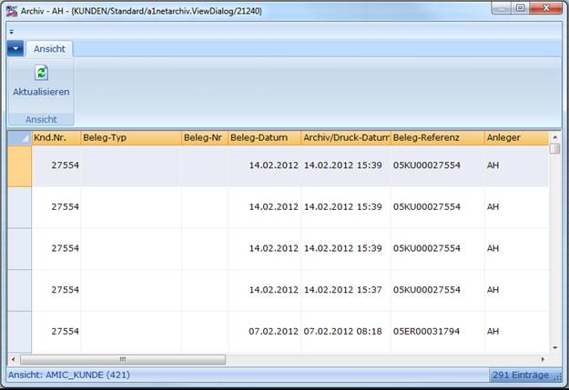

   Mit der Funktion ***Unter der Multifunktionsleiste anzeigen*** lässt sich festlegen, wo die „Multifunktionsleisten-Steuerung“ angezeigt werden soll.

4) Im unteren Bereich findet sich die Information, um welche Ansicht es sich handelt (in diesem Beispiel um die Archiv-Ansicht „AMIC_KUNDE“ mit der Ansichts-ID 421. Des Weiteren hat das System 291 Archiv-Einträge komplett geladen.

   Mit Hilfe der Funktion ***Aktualisieren*** werden die Daten neu ermittelt und geladen.

5) In den Spalten-Köpfen können Sie Sortierungen vornehmen und via Drag&Drop Spaltenreihenfolgen bestimmen.

   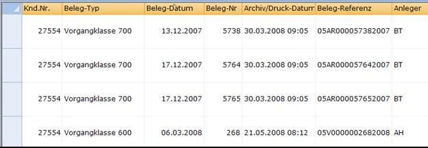

   Hier wurde z.B. aufsteigend nach „Beleg-Datum“ sortiert und die „Beleg-Nr“-Spalte per Maus hinter die „Beleg-Datum“ positioniert.

   Außerdem lassen sich die Breiten der Spalten per Maus festlegen. Spaltenreihenfolgen und Spaltenbreiten werden sich übergreifend gemerkt, Sortierungen nicht.

6) Positionieren Sie die Maus z.B. auf die „Beleg-Datum“-Spalte und betätigen Sie das kleine Dreieck 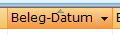, dann können Sie eine Auswahl der angezeigten Daten bestimmen:

   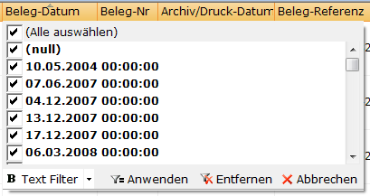

   Mit Hilfe von „Text Filter“ können Sie weitere Spezialisierungen vornehmen.

   Diese Eingrenzungsmöglichkeiten sind spaltenübergreifend nutzbar und damit können vielfältigste Recherchen durchgeführt werden.

7) Gibt es eine Spalte „Container-Inhalt“ die den Archiv-Eintrag icon-mäßig visualisiert.

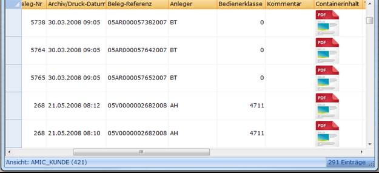

8) Hinzufügen via Drop&Drag

   Sie können aus Outlook heraus Mails in diesen Dialog ziehen und diese so dem Aeins-Archiv-kontext hinzufügen.

   Wenn Sie das getan haben, fragt Aeins, ob Sie noch eine nachträgliche Katalogisierung vornehmen möchten:

   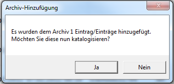

   Bejahen Sie dies, haben Sie die Gelegenheit, die neu hinzugefügten Archiv-Einträge archiv-technisch nachzubearbeiten:

   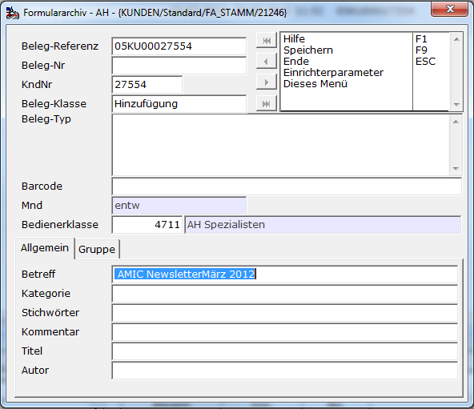

   Diesem Beispiel entnehmen Sie bitte, das das Betreff-Feld schon automatisch mit dem Betreff der Mail initialisiert und gespeichert wurde.

**9) Archiv-Ableitung**

   Die Praxis hat gezeigt, dass in einigen Fällen eine volle Kontrolle über das Datengewinnungs-Sql verfügbar sein muss. Mit Hilfe der Funktion ***Ableitung*** **[SF2]** erhält man individuelle Zugriffsmöglichkeiten auf eine gesamte Archiv-Ansicht, also Auslierung und Privatisierungen über alle Bedienerklassen.

   Man hat also die Möglichkeit eine private „Ableitung“ zu definieren. Diese Ableitung bleibt über Updates hinaus bestehen.

   Sie definieren eine Ableitung über die Pflege eines XML-Dokumentes im Editor.

   Ist noch keine Ableitung gespeichert stellt sich das zum Beispiel für „AMIC_KUNDEN“ so dar:

```xml
<?xml version="1.0" encoding="utf-8"?>
<Description Name="AMIC_KUNDE" RowHeight="60" Version="7.8.5.157">
  <Field Name="fa.fa_kundennummer" Caption="Knd.Nr." />
  <Field Name="fa.fa_belegtyptext" Caption="Beleg-Typ" />
  <Field Name="fa.fa_belegnummer" Caption="Beleg-Nr" />
  <Field Name="fa.fa_belegdatum" Caption="Beleg-Datum" />
  <Field Name="fa.fa_druckdatum" Caption="Archiv/Druck-Datum" />
  <Field Name="fa.fa_belegreferenz" Caption="Beleg-Referenz" />
  <Field Name="fa.fa_neuanlagebediener" Caption="Anleger" />
  <Field Name="fa.fa_bedienerklasse" Caption="Bedienerklasse" />
  <Field Name="fa.fa_info_kommentar" Caption="Kommentar" />
  <Field Name="aeinspic.i_image" Caption="Containerinhalt" Bitmap="true" />
  <Field Name="fa.fa_info_titel" Caption="Titel" />
  <Field Name="fa.fa_belegklasse" Caption="Beleg-Klasse" Format="faklasse" />
  <Field Name="fa.fa_herkunft" Caption="Herkunft" Format="faherkunft" />
  <Field Name="fa.fa_info_betreff" Caption="Betreff" />
  <Field Name="fa.fa_info_autor" Caption="Autor" />
  <Field Name="fa.fa_barcode" Caption="Barcode" />
  <Field Name="fa.fa_formularid" Caption="Formularid" />
  <Field Name="fa.fa_id" Caption="FA-Id" />
  <Field Name="fa.fa_guid" Caption="FA Guid" Visible="false" />
  <Field Name="fa.fa_mndnr" Caption="MndNr" Visible="false" />
  <Field Name="fa.fa_mandant" Caption="Mandant" Visible="false" />
  <Field Name="fa.fa_dateiname" Caption="Dateiname" />
  <!-- With-Statement -->
  <With />
  <!-- Limitation Statement -->
  <Limitation></Limitation>
  <!-- From-Statement -->
  <From>
    from formulararchiv fa
    left outer join amic_v_images aeinspic on (aeinspic.i_mime=fa.fa_mime)
  </From>
  <!-- Join Statement -->
  <Join>left outer join amic_fa_fibu(:!jvars_5001_ZW1) aff on ( fa.fa_id=aff.fa_id and fa.fa_mndnr=aff.fa_mndnr)
left outer join amic_fa_crw(:!jvars_5001_ZW1) fagcrw on (fagcrw.fa_id=fa.fa_id and fagcrw.fa_mndnr=fa.fa_mndnr )</Join>
  <!-- Where Statement -->
  <Where>where (1=1)  and isnull( fa.fa_progintern , 0 ) in ( -1 , 0 ) and ( ( ( (isnull(fa.fa_kundennummer,0) = :!jvars_5001_ZW1
or isnull(fa.fa_belegreferenz,'') = ':!jvars_5001_ZW2')
or (aff.fa_id=fa.fa_id and aff.fa_mndnr=fa.fa_mndnr)
or ( fagcrw.fa_id=fa.fa_id and fagcrw.fa_mndnr=fa.fa_mndnr) )  ) and ((select fab_wer from formulararchivbediener where  fab_wer=:!jvars_3561_jvar_system_status_bedienerklasse and fab_darf=fa.fa_bedienerklasse) is not null) or ( 1 = 0 ) )</Where>
  <!-- group by-Statement -->
  <GroupBy />
  <!-- order by-Statement -->
  <OrderBy>order by fa.FA_Druckdatum desc</OrderBy>
</Description>
```

| Description - Attribute | | |
| --- | --- | --- |
| Name | Name der zugrunde liegenden Archiv-Anischt. | Dokumentatorischer Charakter. |
| RowHeight | Bestimmt die Höhe der Archiv-Ansichtszeilen im Grid. | Standard sind 60 Pixel, ohne Grafiken wird 22 empfohlen. |
| Version | Die A.eins-Version bei erstmaliger Erstellung der Ableitung. | Dokumentatorischer Charakter. |

<div class="table-wrapper">
  <table>
    <tbody>
      <tr>
        <td colspan="4">
          <p><strong>Description- Nodes</strong></p>
        </td>
      </tr>
      <tr>
        <td>
          <p>Field</p>
        </td>
        <td>
          <p>Name</p>
        </td>
        <td>
          <p>Name der Sql-Spalte</p>
        </td>
        <td></td>
      </tr>
      <tr>
        <td></td>
        <td>
          <p>Caption</p>
        </td>
        <td>
          <p>Beschriftung der Sql-Spalte</p>
        </td>
        <td></td>
      </tr>
      <tr>
        <td></td>
        <td>
          <p>Bitmap</p>
        </td>
        <td>
          <p>true oder false, Standard ist false</p>
        </td>
        <td>
          <p>Gibt an, ob sich beim Inhalt der Sql-Spalte um eine Grafik handelt.</p>
        </td>
      </tr>
      <tr>
        <td></td>
        <td>
          <p>Format</p>
        </td>
        <td>
          <p>Name des A.eins-Format</p>
        </td>
        <td>
          <p>Ähnlich wie bei der A.eins-Auswahlliste und den A.eins-Itemboxen kann man hier eine „textuelle Entsprechung“ des Wertes der Sql-Spalte angegeben.</p>
        </td>
      </tr>
      <tr>
        <td></td>
        <td>
          <p>Visible</p>
        </td>
        <td>
          <p>true oder false, Standard ist true</p>
        </td>
        <td>
          <p>Nicht alle Felder will man in jedem Falle auch anzeigen, gleich wohl wird der Wert eines solchen Feldes vielleicht für weitere Verwendungen (Funktionen) benötigt.</p>
        </td>
      </tr>
      <tr>
        <td></td>
        <td>
          <p>Sql</p>
        </td>
        <td>
          <p>Sql-Statement zur Gewinnung des Wertes der Sql-Spalte</p>
        </td>
        <td></td>
      </tr>
      <tr>
        <td>
          <p>With</p>
        </td>
        <td></td>
        <td>
          <p>Sql-Statement für ein optionales With</p>
        </td>
        <td>
          <p>Weitere Erläuterungen entnehmen Sie bitte der Sybase-Dokumentation.</p>
        </td>
      </tr>
      <tr>
        <td>
          <p>Limitation</p>
        </td>
        <td></td>
        <td>
          <p>Sql-Anweisung für eine optionale Limitierung des Resultsets.</p>
        </td>
        <td></td>
      </tr>
      <tr>
        <td>
          <p>From</p>
        </td>
        <td></td>
        <td>
          <p>Sql-Anweisung für From</p>
        </td>
        <td></td>
      </tr>
      <tr>
        <td>
          <p>Join</p>
        </td>
        <td></td>
        <td>
          <p>Optionale Erweiterung des obigen „From“</p>
        </td>
        <td>
          <p>Bei der Erst-Initialisierung einer Ableitung belegt A.eins diese mit dem Resultat der Archiv-Ansicht vor!</p>
        </td>
      </tr>
      <tr>
        <td>
          <p>Where</p>
        </td>
        <td></td>
        <td>
          <p>Where-Klausel des Sql-Statements</p>
        </td>
        <td>
          <p>Bei der Erst-Initialisierung einer Ableitung belegt A.eins diese mit dem Resultat der Archiv-Ansicht vor!</p>
          <p>Beachten Sie unbedingt das Sie bei Änderungen hinsichtlich <b>fa_progintern</b> und dem Sichtschutz-Konzept über <b>formulararchivbediener </b>alleinverantwortlich</p>
          <p>handeln.</p>
        </td>
      </tr>
      <tr>
        <td>
          <p>GroupBy</p>
        </td>
        <td></td>
        <td>
          <p>Optionale GroupBy-Klausel des Sql-Statements</p>
        </td>
        <td></td>
      </tr>
      <tr>
        <td>
          <p>OrderBy</p>
        </td>
        <td></td>
        <td>
          <p>Optionale OrderBy-Klausel des Sql-Statements</p>
        </td>
        <td></td>
      </tr>
    </tbody>
  </table>
</div>

Sie können eine Ableitung löschen, indem Sie sämtlichen Text im Editor löschen und dann Speichern.

Das System erkennt Änderungen bzw. reagiert nur dann, wenn Sie auch Änderungen durchführen!

Das eine Ableitung „aktiv“ ist erkennen Sie visuell auf der Maske:

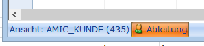

Mit Hilfe der Funktion ***Ableitung Export*** können Sie die Ableitung exportieren.

<p class="siehe-auch">Siehe auch:</p>

- [„Archiv ansehen“](./archiv_ansehen.md)
