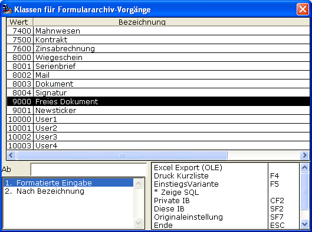

# Archiv-Ansicht-Definition

<!-- source: https://amic.de/hilfe/_archivansichtdefinit.htm -->

Ausgelöst wird eine Archiv-Ansicht über die Funktion ***Archiv anzeigen*** **CF12** im jeweiligen Programm-Kontext in A.eins. ([Ansichten allgemein](../ansichten_allgemein/index.md))

Eine Archiv-Ansichts-Definition ist im einfachsten Fall eine von AMIC vorkonfektionierte Beschreibung, mit deren Hilfe A.eins im Archiv recherchiert.

Der Programm-Kontext in A.eins stellt automatisch (fest vorgegebene) Kriterien zur Verfügung, die in der Archiv-Ansicht-Definition zur Auswertung und Bestimmung, welche Archiv-Einträge in der Archiv-Ansicht aufgelistet werden sollen, herangezogen werden können.

Alle ausgelieferten Archiv-Ansicht-Definitionen, die von AMIC mitgeliefert und bei Programmupdate aktualisiert werden, finden sich in der Variante Archiv-Ansichten-Variante: Ansichten ( nur AMIC – Auslieferung ).

Tabelle 5 Wichtige Archiv-Ansicht-Definitions-Begriffe

  <table>
    <tbody>
      <tr>
        <td colspan="2"></td>
      </tr>
      <tr>
        <td>
          
Name

        </td>
        <td>
          
Sammelbegriff für Archiv-Ansichten gleichen Typus.

          
Der Name des Ansichtsprofils.

          
Eine so zusätzlich angelegte Ansichts-Definition kann nun auf einfache Weise ins A.eins-System integriert werden. Dazu bindet man eine private Funktion in die entsprechende Optionbox ein. Der Controlstring lautet ^jpl fa_view Name, wobei dann für Name der jeweilige Name zu setzen ist.

          
Alle AMIC-Standard-Ansichten werden intern auf die Funktionalität fa_view umgesetzt.

        </td>
      </tr>
      <tr>
        <td>
          
Bedienerklasse

        </td>
        <td>
          
Bedienerklasse

          
Hinweis: Die Bedienerklasse -1 bedeutet stets alle Bedienerklassen.

          
Eine Ansichtsdefinition kann für eine einzelne Bedienerklasse bestimmt werden. Diese hat dann zur Laufzeit für ein Mitglied der Bedienerklasse Vorrang vor der speziellen Bedienerklasse -1.

          
Somit ist es möglich individuelle Ansichtsdefinitionen für spezielle Bedienerklassen auszuprägen.

        </td>
      </tr>
      <tr>
        <td>
          
Besitzer

        </td>
        <td>
          
AMIC: Eine von AMIC ausgelieferte Ansichtsdefinition

          
Privat: Eine vom A.eins-Anwender erstellte Ansichtsdefinition

        </td>
      </tr>
      <tr>
        <td>
          
Ansichts-Id

        </td>
        <td>
          
Technische Identifikation einer Ansichtsdefinition.

        </td>
      </tr>
    </tbody>
  </table>

Über die Pflege-Funktionen in den unter „[Archiv-Ansichten definieren](../archiv_ansichten_definieren/index.md)“ angegebenen Varianten erhält man Zugriff auf folgende weitere allgemeine Merkmale einer Archiv-Ansichten-Definition:

  <table>
    <tbody>
      <tr>
        <td colspan="2"></td>
      </tr>
      <tr>
        <td>
          
Dokument

        </td>
        <td>
          
JA/NEIN

          
Bestimmt ob „persönliche Dokumente“ beim Öffnen/Ausführen der Ansicht über <strong>CF12</strong> dem Kontext der entsprechenden A.eins-Lokalität zugewiesen werden sollen – oder nicht.

          
A.eins bietet die Möglichkeit „persönliche/private“ Dokumente, die sogenannten „freien Dokumente“ (Belegklasse 9000) ins System zu importieren. Diese haben die Eigenschaft, dass, wenn man an geeigneter Stelle eine Formulararchiv-Ansicht aufruft, sie eben diesen aufgerufenen Kontext zugeordnet werden. Weitere Erläuterungen/Konfigurierungen bei der Behandlung der „Details“ .

          
          
„Geeignete Stellen“ sind somit Profile/Ansicht – Umgebungen, in denen man eben hier diese Möglichkeit vorsieht.

          
So bietet es die Möglichkeit, 9000er-Zuweisungen auf bestimmte Bereiche einzugrenzen. Eben weil man u. U. viel mit <strong>SF4</strong> arbeitet und ansonsten eine „Fehlzuweisung“ passieren könnte.

        </td>
      </tr>
      <tr>
        <td>
          
Zusatz

        </td>
        <td>
          
JA/NEIN

          
Bestimmt, ob zusätzlich zu den durch die Ansicht-Definition bestimmten Archiv-Einträgen auch alle die Archiv-Einträge aufgelistet werden, die weder eine Kundennummer noch eine Beleg-Referenz haben.

          
Unterstützung einer möglichen Organisationsform hinsichtlich des Fehlens von Kundennummer und Belegreferenz von Archiv-Einträgen. Solche Dokumente kommen vornehmlich per Scanner-Importverfahren oder ähnlich gearteten Verfahren ins System. Jedenfalls ist die Absicht, genau diese im Grunde noch nicht zugeordneten Belege an jeder Stelle im Programm, in der in das Formulararchiv gesehen wird, den Sachbearbeitern zur Kenntnis zu bringen.

          
Diese haben dann die Möglichkeit den Beleg einzusehen und ggf. durch „Bearbeiten“ eine Kundennummer und/oder Referenznummer zuzuordnen, um somit den Beleg „abzuarbeiten“.

          
Unterstützung bezüglich dieser Bearbeitung bietet auch der Punkt „Autoedit“.

        </td>
      </tr>
      <tr>
        <td>
          
Autoedit

        </td>
        <td>
          
JA/NEIN

          
Bestimmt, ob bei der Funktion <strong>F5</strong> in der Formulararchiv-Anzeige die Felder „Kundennummer“ und „Beleg-Referenz“ automatisch mit dem jeweiligen A.eins-Kontext belegt werden.

        </td>
      </tr>
      <tr>
        <td>
          
Ausschluss

        </td>
        <td>
          
Hier kann eine durch Komma getrennte Liste von Beleg-Klassen angegeben werden, deren Archiv-Einträge nicht angelistet werden sollen.

        </td>
      </tr>
      <tr>
        <td>
          
Durchstart

        </td>
        <td>
          
JA/NEIN

          
Ergibt die durch die Ansichts-Definition veranlasste Archiv-recherche, dass genau ein „Dokument“ gefunden wurde, so wird die Anzeige dieses einen Dokumentes sofort ohne weitere Rückfrage durch das Programm eingeleitet.

        </td>
      </tr>
      <tr>
        <td>
          
Hinzufügen

        </td>
        <td>
          
JA/NEIN

          
In der Formulararchiv-Anzeige wird die Funktion <strong><em>Hinzufügen</em></strong> <strong>F8</strong> aktiviert.

        </td>
      </tr>
      <tr>
        <td>
          
Bed.Schutz

        </td>
        <td>
          
JA/NEIN

          
Bestimmt ob das Schutz-System über die Bedienerklasse des Archives aktiviert wird.

        </td>
      </tr>
      <tr>
        <td>
          
Priv. Import aktiviert

        </td>
        <td>
          
JA/NEIN

          
Bestimmt ob während der Archiv-Recherche der „Private Import“ durchgeführt wird.

          
<a href="./archiv_privater_import.md">Archiv: Privater Import</a>

        </td>
      </tr>
      <tr>
        <td>
          
Profilpfad

        </td>
        <td>
          
Ein hier hinterlegter Pfad wird von A.eins automatisch um den Kurznamen des jeweiligen ausführenden Bedieners erweitert und bestimmt dann den Pfad für den „Privaten Import“.

          
<a href="./archiv_privater_import.md">Archiv: Privater Import</a>

        </td>
      </tr>
      <tr>
        <td>
          
Profilfilter

        </td>
        <td>
          
Reguläres Muster für Importfilter

          
<a href="./archiv_privater_import.md">Archiv: Privater Import</a>

        </td>
      </tr>
      <tr>
        <td>
          
Einsatz

        </td>
        <td>
          
Beschreibung über den Einsatz bzw. Verwendungen der Ansichts-Definition.

        </td>
      </tr>
      <tr>
        <td>
          
Grundlage

        </td>
        <td>
          
Versucht über das Einsatzgebiet der <a href="">Archiv-Ansichten</a> zu informieren.

          
Mögliche Identifizierungen sind:

          
0 : Frei

          
1 : Auswahlliste

          
2 : Dialog

          
3 : Extern

          
4: Auswahl

        </td>
      </tr>
      <tr>
        <td>
          
Variante

        </td>
        <td>
          
Variante, die zur Formulararchiv-Anzeige herangezogen wird.

        </td>
      </tr>
      <tr>
        <td>
          
Anwendung

        </td>
        <td>
          
Anwendung, die zur Formulararchiv-Anzeige herangezogen wird.

          
Zurzeit ist diese auf „fa_anzeige“ festgelegt und nicht veränderbar.

        </td>
      </tr>
      <tr>
        <td>
          
Dialog

        </td>
        <td>
          
JA/NEIN

          
Bestimmt, ob die Formulararchiv-Anzeige als Dialog oder Nicht-Dialog gestartet wird. Empfehlung=JA

        </td>
      </tr>
      <tr>
        <td>
          
Vorschau

        </td>
        <td>
          
JA/NEIN

          
Aktiviert in dieser Ansicht eine erweiterte Archiv-Ansichts-Technologie.

        </td>
      </tr>
    </tbody>
  </table>

Siehe auch:

- [Archiv: Privater Import](./archiv_privater_import.md)
