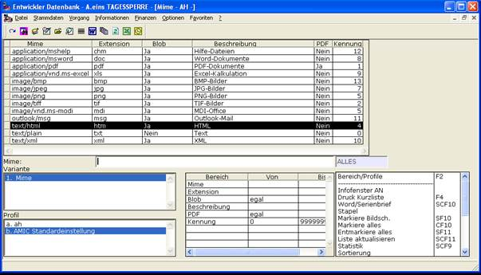

# Archiv Ansehen

<!-- source: https://amic.de/hilfe/_archivansehen.htm -->

Archivierte Belege und Dokumente zur Ansicht bringen.

Um nachfolgende Erläuterungen verstehen zu wollen, muss man etwas über sogenannte Mimetypen wissen. Umfassende Informationen bekommt man etwa bei [http://de.wikipedia.org/wiki/Multipurpose_Internet_Mail_Extensions](http://de.wikipedia.org/wiki/Multipurpose_Internet_Mail_Extensions) und folgende.

Das Formulararchiv speichert durchweg binäre Informationen, die für sich allein keinen Informationsgehalt darstellen. Man benötigt eine weitere Klassifizierung, um was es sich bei den Daten handelt, um sinnvoll damit interagieren zu können. Es wird also so etwas wie die Extension zusätzlich benötigt, um diese Informationen dann entsprechend weiterzuverarbeiten. Da Extensionen aber nicht immer hinreichend sind (so können z.B. \*.doc - Dateien von ganz verschiedenen Programmen stammen!), verwendet A.eins von Anfang an das etwas umfassendere Konzept der Mime-Typen. Siehe z.B. http://www.webmaster-toolkit.com/mime-types.shtml.

A.eins und das Formulararchiv „kennen“ folgende Typen, die in der Relation AMIC_Mime hinterlegt sind und zum Zeitpunkt der Drucklegung folgenden Umfang besitzt:

Diese Definitionen werden von AMIC ausgeliefert und werden in späteren Versionen frei konfigurierbar zur Verfügung gestellt.

Die Blob-Spalte weist das Ansichts-System an, die Darstellung im A.eins-eigenen Rahmen durchzuführen, sobald der Mimetyp als nicht-blob-fähig gekennzeichnet ist.

Die PDF-Kennung ist selbsterklärend und informiert das A.eins-System, welcher Mimetyp intern als PDF zu behandeln ist.

Siehe auch:

- [Ansichten allgemein](./ansichten_allgemein/index.md)
- [Archiv-Ansicht-Definition](./archiv_ansicht_definition/index.md)
- [Archiv-Ansichten definieren](./archiv_ansichten_definieren/index.md)
- [Archiv-Ansichten-Variante: Ansichten](./archiv_ansichten_variante_ansichten/index.md)
- [Archiv-Ansichten-Variante: Profile](./archiv_ansichten_variante_profile/index.md)
- [Archiv-Ansichten-Variante: Ansichten – Vorkommen](./archiv_ansichten_variante_ansichten_vorkommen.md)
- [Archiv-Ansichten-Variante: Ansichten – Variantenaufkommen](./archiv_ansichten_variante_ansichten_variantenaufkommen.md)
- [Archiv-Ansichten-Variante: Ansichten – Detailvorkommen](./archiv_ansichten_variante_ansichten_detailvorkommen.md)
- [Archiv-Ansichten-Variante: Ansichten – Richtlinien](./archiv_ansichten_variante_ansichten_richtlinien.md)
- [Vorkommen Ansichten sichten](./vorkommen_ansichten_sichten.md)
- [Dokumente mehrfach hinzufügen](./dokumente_mehrfach_hinzufuegen.md)
