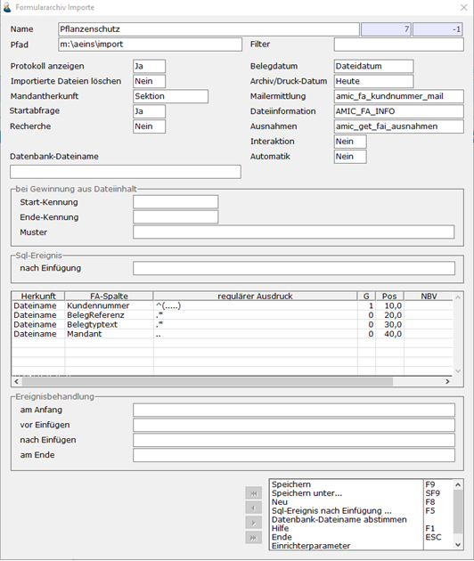

# Beispiel 1 - Dateiinhalt

<!-- source: https://amic.de/hilfe/_beispiel1dateiinhalt.htm -->

In diesem Falle werden die Kerndaten sämtlich aus dem Dateinamen gewonnen.

Man sieht, dass die FA-Spalten (Kerndaten) „Kundennummer, Belegreferenz, Belegtyptext und Mandant“ explizit ermittelt werden soll.
