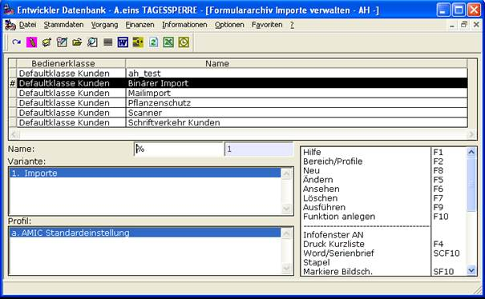
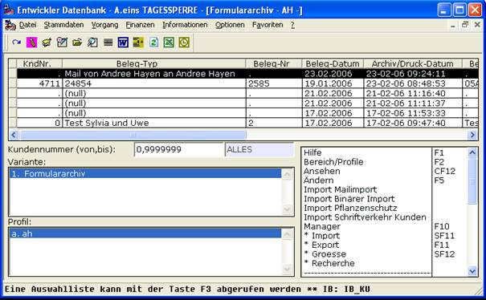

# Funktion anlegen

<!-- source: https://amic.de/hilfe/_funktionanlegen.htm -->

Damit können Sie in der Anwendung „Formulararchiv“ automatisch eine private Funktion anlegen lassen, die das spezifizierte Profil aufruft und durchführt. Aus technischen Gründen steht diese Funktion nicht unmittelbar zur Verfügung. Nach einem Neustart von A.eins soll sie aber vorhanden sein.

Durch die Funktionalität ***Funktion anlegen*** werden Funktionen in der Anwendung Formulararchiv integriert um den Aufruf komfortabel zu gestalten.

Siehe auch:

- [Beispiel 1 - Dateiinhalt](./beispiel_1_dateiinhalt.md)
