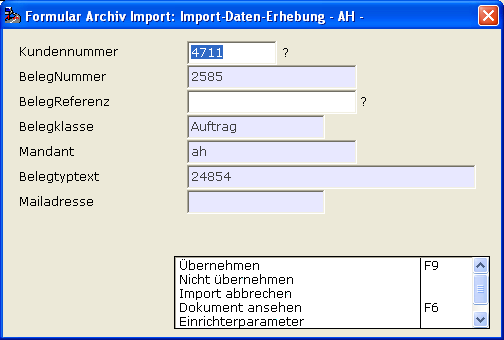

# Interaktion während des Importvorgangs Archiv

<!-- source: https://amic.de/hilfe/_interaktionwhrenddes.htm -->

Nach Ermittlung der Kriterien durch reguläre Ausdrücke und optionalen Script, besteht nun noch die Möglichkeit, das trotz alledem keine entsprechenden Daten ermittelt worden konnten.

Im Normalfall wird der Import vereinbarungsgemäß nicht durchgeführt.

Oftmals kann und sollte diese fehlende Information aber vom Bediener ggf. nachgefragt und nachgetragen werden. Per Interview lässt sich das somit gleich durchführen.

Aktiviert wird das Verfahren über den Schalter „Interaktiv“.

Das System wird bei fehlenden Daten, das sind genau solche die einen reguläres Kriterium haben und zu keinem Ergebnis führen eine Dialogmaske öffnen und den Benutzer fragen.

Eine beispielhafte Interview-Maske sei die folgende:

Die Fragezeichen weisen die Kriterien „Kundennummer“ und „Belegreferenz“ als nicht gültig bzw. als nicht ermittelbar aus und es ist am Bediener diese Daten zu ermitteln.

Der Bediener kann nun den Import „übernehmen“, er kann auch diesen aktuellen einzelnen Beleg „nicht übernehmen“ und er kann den gesamten „Import abbrechen“.

Bis dato importierte Daten bleiben importiert!
