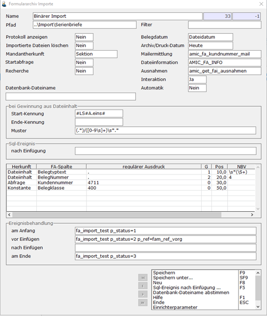
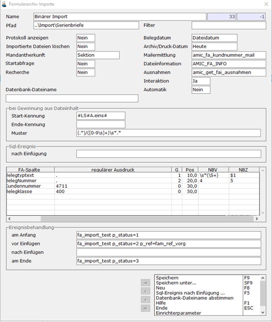

# Beispiel 2 - Komplex

<!-- source: https://amic.de/hilfe/_beispiel2komplex.htm -->

Dieses Beispiel demonstriert den binären Import aus dem Pfad ..\\Import\\Serienbriefe.

Es erwartet Dateien, die intern eine Signatur #LS#A.eins# tragen. Anschließend an diese Signatur sind lt. Beispiel der Belegtyptext getrennt durch ein „/“ – Zeichen mit beliebig vielen Dezimalziffern und Leerzeichen folgend.

In der Tabelle werden über die Gruppen-Zuweisungen G (1 und 2) jeweils die zu erwartenden Kerndaten den regulären Gruppen zugeordnet.

Die Nachbearbeitung des Belegtyptextes führt ausgehend von

\\s\*(\\S\*) ein $1 durch, was einfach nur eine Eliminierung von führenden Leerzeichen bedeutet. Die Nachbearbeitung der Belegnummer demonstriert das einfache Ersetzen; in diesem Falle wird einfach jede 4 durch eine 5 ersetzt.

Die Parameter NBV und NBZ stellen nützliche kleine Helferlein zur Verfügung will man nicht wesentlich umständlichere Nachbearbeitungen im Nachhinein anstellen!
