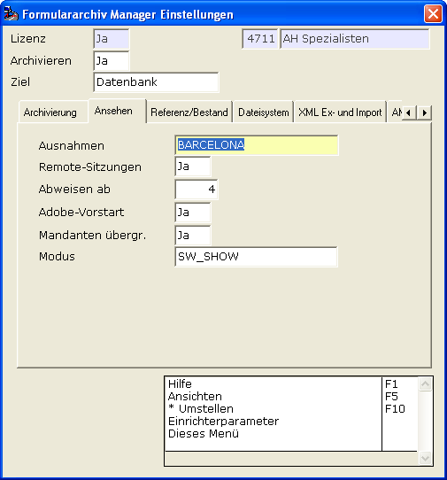
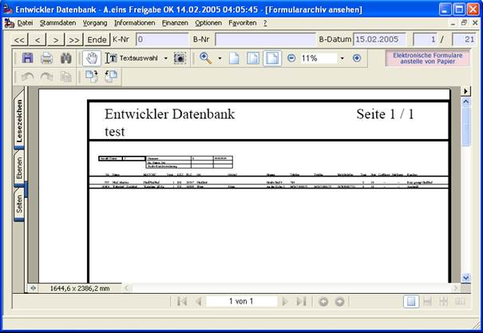

# Ansehen

<!-- source: https://amic.de/hilfe/_ansehen.htm -->

Befinden sich die Belege im Formulararchiv, dann möchte man sie auch hin- und wieder ansehen. A.eins beherrscht das Anzeigen der Belege, muss sich aber gewissen Umständen beugen …

Hier finden sich vielfältige Einstellungsmöglichkeiten die sich des Themas „Ansehen“ eines Beleges aus dem Archiv heraus annehmen.

Das Archiv kann neben der „normalen“ Vorgangserzeugung, also ASCII, PDF- und Tiff-Dateien inzwischen eine ganze Reihe weiterer Formate behandeln und zur Ansicht bringen.

Die „Ansicht“ selber wird dabei den gemein gängigen Programmen der Windows-Welt überlassen. Diese spezialisierten Programme bieten in aller Regel neben der Ansicht noch weitere Funktionalitäten, so z.B. der Adobe Mail-Versand etc. pp. Deshalb wird diese Methode von A.eins favorisiert. Sie hat nur den kleinen Nachteil, dass diese externen Programme auf bestimmten Systemen ihre Eigenheiten haben. So ist als Beispiel zu nennen, dass der Adobe in integrierter Form in A.eins (embedded) auf Terminalservern zu erheblichen Anzeige-Updates führt, die ein flüssiges Arbeiten im herkömmlichen Sinne nicht unterstützen.

Ein Problem stellt die so genannte eingebettete Ansicht dar, am Beispiel eines PDF-Beleges sieht man, dass die zugrunde liegende Applikation (bei PDF der Adobe Acrobat Reader) im A.eins-Fenster eingebettet ist (das geht wie oben gesehen auch mit z.B. Word- und Excel-Dokumenten).

Mit Hilfe der Pfeil-Kontrollen lässt sich gerade bei Mehrfachauswahl in der zugrundenliegenden Auswahlliste schön hin- und herblättern.

Das funktioniert auf den allermeisten Arbeitsplätzen einwandfrei.

Auf Terminalservern und einigen Notebooks hingegen bekommt das System Refresh-Probleme und in diesen Fällen wird die Geduld des Anwenders arg strapaziert. Leider enthebt sich diese Problematik meinen Zugriffsmöglichkeiten, aber es gibt einen Ausweg. Man kann konfigurieren, dass die Ansicht nicht integriert sein soll, dann wird ein extra Fenster aufgemacht und der Beleg dort dargestellt. Man könnte meinen, dass damit alle Probleme gelöst sind, aber wie so oft handelt man sich dadurch ein neues ein. Hat man mehrere Belege markiert und will sie ansehen, dann werden systembedingt alle diese Belege in den Arbeitsspeicher geladen. Man muss nun kein Prophet sein, um zu ersinnen, was wohl mit der laufenden A.eins-Sitzung und dem Arbeitsplatz passiert. Deshalb gibt es auch wieder eine Einstellmöglichkeit, um diese Anzahl zu begrenzen.

Siehe auch:

- [Ausnahmen](./ausnahmen.md)
- [Remote-Sitzungen](./remote_sitzungen.md)
- [Adobe-Vorstart](./adobe_vorstart.md)
- [Abweisen ab](./abweisen_ab.md)
- [Mandanten übergreifend](./mandanten_uebergreifend.md)
- [Modus](./modus.md)
