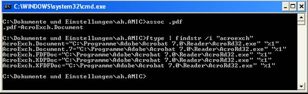
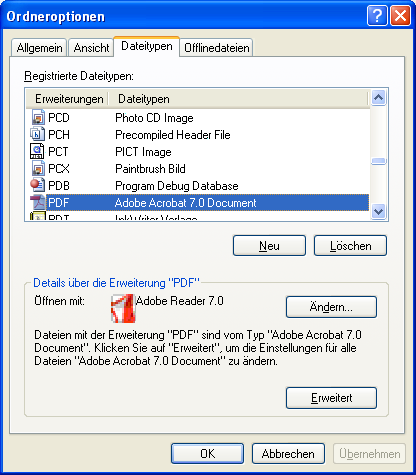
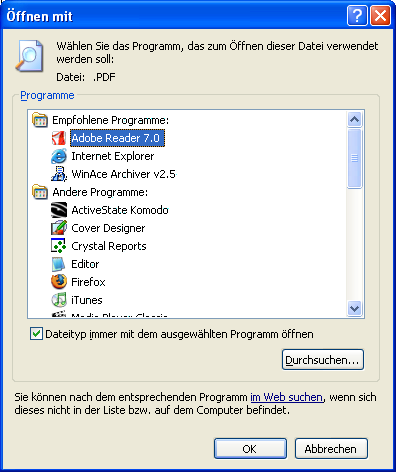
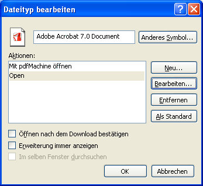
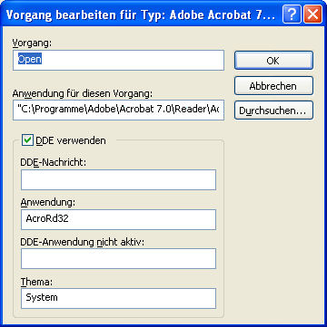
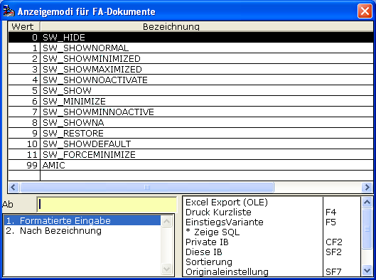
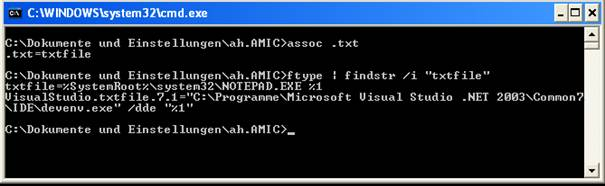

# Modus

<!-- source: https://amic.de/hilfe/_modus.htm -->

Wie schon erwähnt verwaltet das Archiv eine ganze Reihe von verschiedenartigen Dokumenten. Über die gängigen Office-Dokumente über PDF bis hin zu TIFF kann alles vertreten sein. Das Ansehen dieser Dokumente wird nicht länger von A.eins übernommen, sondern eher den installierten Spezialisten auf dem jeweiligen Computersystem bzw. den jeweiligen Vorlieben des Anwenders.

Möchte nun der A.eins-Anwender ein Dokument anschauen, so delegiert A.eins diese Aufgabe an das Windows-System. Dieses nämlich hat u.a. hinterlegt welches Programm dafür zuständig sein soll. Auf einem Windows-XP System kann man z.B. für PDF-Dateien folgendes recherchieren:

Somit ist der Adobe 7.0 auf meinem System der aktuelle Viewer des PDF-Dokumentes.

Auch im Windows-Explorer unter ANSICHT/OPTIONEN erhält man

Unter ÄNDERN die Möglichkeit evtl. ein Alternativ-Programm zu wählen:

Und unter ERWEITERT

weitere

Diese Dinge sind zur Kenntnis wichtig, wenn es z.B. darum geht, zur Ansicht den Adobe-Reader und nicht etwa ein anderes Programm zu überreden.

Der „Modus“ bestimmt nun in welchem Öffnungs-Modus bezüglich des Öffnens des Dokumentes sich das Ansehen-Programm öffnen möchte. Dieses ist nur ein Vorschlag an Windows von A.eins das Anliegen an das Öffnungs-Verhalten der Ansehen-Anwendung weiterzureichen. Viele Programme halten sich daran, aber leider nicht alle. Das muss im Einzelfall ausprobiert werden.

Jedenfalls stehen die Original-Windows-Fenster-Öffnungstechniken zur Verfügung und werden auch so direkt weitergereicht:

Gängig und empfohlen ist SW_SHOW.

Das Format 99 AMIC ist notwendig weil im Falle von ASCII-Archivierung dann wegen

In der Mehrheit aller Fälle das Windows-Notepad geöffnet werden würde. Dieses ist sicherlich nicht beabsichtigt! Deswegen bei ASCII-Archivierungen im System Vorschlag: 99
