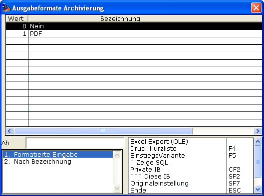
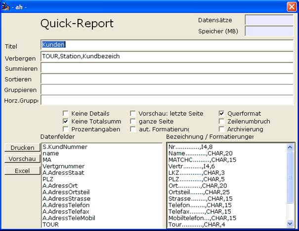

# Quick-Reporte mit archivieren

<!-- source: https://amic.de/hilfe/_quickreportemitarchi.htm -->

Die grundsätzliche Aktivierung der Archivierung von Quick-Reporten wird per

festgelegt.

Für den einzelnen Quick-Report lässt sich dann im dortigen Einrichter-Dialog festlegen, ob eine Archivierung durchgeführt werden soll.

Technisch ist eine Archivierung ins TIFF-Format noch nicht realisiert.
