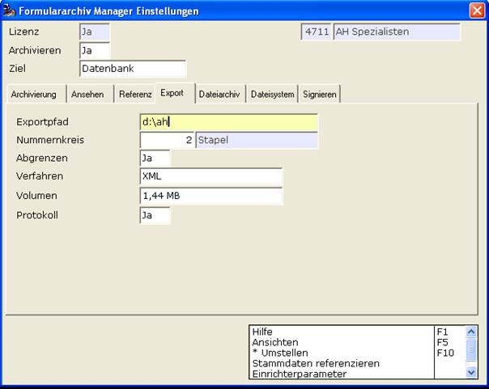

# Archivierung Datenbank – Export

<!-- source: https://amic.de/hilfe/_archivierungdatenban.htm -->

Um die in der Datenbank befindlichen Belege ins Dateisystem exportieren zu können, findet man an dieser Stelle die Einstellungsmöglichkeiten, um diese Aufgabe durchzuführen.

