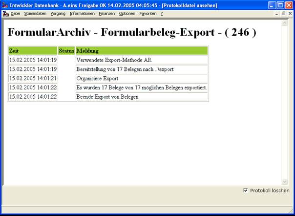

# Export AMICAR-Verfahren

<!-- source: https://amic.de/hilfe/_exportamicarverfahre.htm -->

Die AMICAR-Methode ist unter „Dateisystem – Abgrenzung“ beschrieben.

(Beachten Sie bitte dass es natürlich keinen Export gibt, wenn man sich für die Archivierung ins Dateisystem entschieden haben sollte)

Ist der Export durchgeführt dann bekommen Sie z.B. folgendes Protokoll

welches über Status, Umfang und Vorkommnisse beim Export berichtet.

Beim AMICAR-Verfahren können Sie zusätzlich über die Einstellung [Volumen](./volumen.md) eine gewünschte Volumenaufteilung durchführen.
