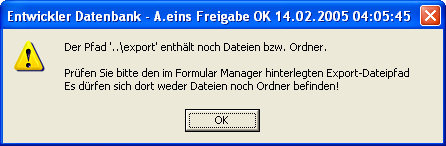
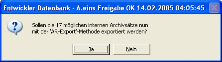

# Export-Pfad

<!-- source: https://amic.de/hilfe/_exportpfad.htm -->

Gibt den Pfad im Dateisystem an, wohin die exportierten Belege exportiert werden sollen.

Der angegebene Export-Pfad muss leer sein, damit man sicher sein kann, dass man einen „sauberen“ Stand hat. Ist der Pfad nicht leer, dann bekommt man die Meldung

Räumen Sie dann z.B. per Windows-Explorer auf, oder wählen Sie einen anderen Export-Pfad.

Ist der Pfad soweit in Ordnung (existiert, ist leer und ist beschreibbar), dann erscheint folgende Abfrage

