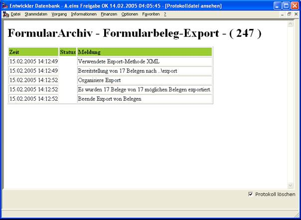
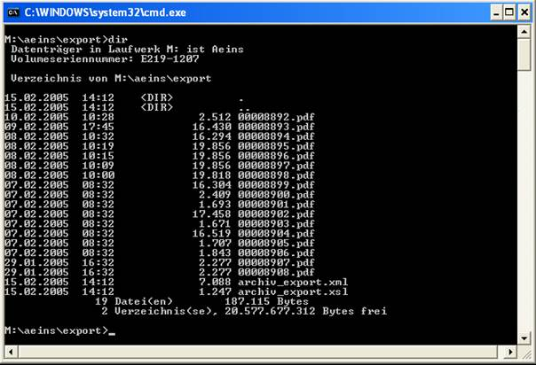
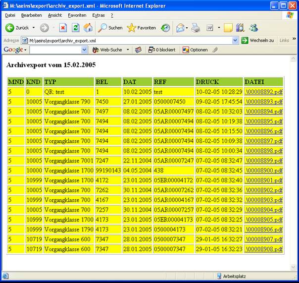

# Export XML-Verfahren

<!-- source: https://amic.de/hilfe/_exportxmlverfahren.htm -->

Die XML-Methode ist die Standard-Methode, um Belege aus dem Formulararchiv zu exportieren.

Die Volumeneinstellung greift bei der XML-Methode nicht.

XML im Allgemeinen ist die Methode schlechthin um Daten von A nach B zu transportieren. Diesen Umstand trägt A.eins in besonderer Form Rechnung, als dass es neben der reinen Datenausgabe auch noch gleichzeitig die Ansehen-Möglichkeit integriert.

Nach erfolgtem Export



sieht das Export-Verzeichnis in etwa so aus



Interessant dabei ist zunächst die erzeugte XML-Datei archiv_export.xml.

Das Format der XML-Datei ist dabei wie folgt (Inhalt gekürzt!)

```xml
<?xml version="1.0" encoding="ISO-8859-1"?>
<?xml-stylesheet type="text/xsl" href=".\archiv_export.xsl"?>
<archiv>
       <VOM>15.02.2005</VOM>
       <BELEG>
             <MND>5</MND>
             <KND>0</KND>
             <TYP>QR: test</TYP>
             <BEL>1</BEL>
             <DAT>10.02.2005</DAT>
             <REF>test</REF>
             <DRUCK>10-02-05 10:28:29</DRUCK>
             <DATEI>.\00008892.pdf</DATEI>
             <STEUER>a2005_02.xml</STEUER>
             <GROESSE>2512</GROESSE>
             <NKR>00008892</NKR>
             <MIME>application/pdf</MIME>
             <MD5>4d04b4f8bd9427ec5bd75788c4c887fe</MD5>
             <BKL>6400</BKL>
       </BELEG>
       <BELEG>
             <MND>5</MND>
             <KND>10005</KND>
             <TYP>Vorgangklasse 790</TYP>
             <BEL>7450</BEL>
             <DAT>27.01.2005</DAT>
             <REF>0500007450</REF>
             <DRUCK>09-02-05 17:45:54</DRUCK>
             <DATEI>.\00008893.pdf</DATEI>
             <STEUER>a2005_02.xml</STEUER>
             <GROESSE>16430</GROESSE>
             <NKR>00008893</NKR>
             <MIME>application/pdf</MIME>
             <MD5>dc01eeb1932a2ab69ccc7e01d7f631ac</MD5>
             <BKL>790</BKL>
       </BELEG>
</archiv>
```

Wie man unschwer erkennen kann befindet sich der wesentliche Inhalt der Relation Formulararchiv in der XML-Datei wieder.

Mit Hilfe des XML-Formates können externe Programme nun leicht die Daten weiterverarbeiten.

Schaut man sich diese XML-Datei im Explorer an, so wird vom Betriebssystem ein weiteres Schmankerl (die XSL-Datei) zur Ansicht herangezogen und der Export repräsentiert sich so:



Wie man unschwer erkennt, sind die Belege per Link erreichbar, also bei Interesse einfach anklicken. Im Internet-Explorer sucht man per **Ctrl + Strg + f**, damit lassen sich also schon einige Fragestellungen abdecken.
