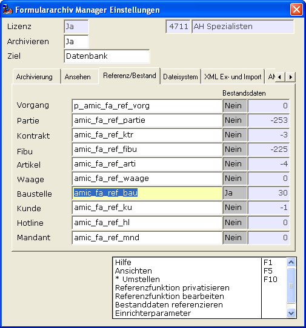
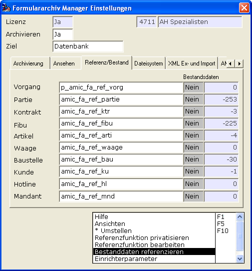

# Bestanddaten referenzieren

<!-- source: https://amic.de/hilfe/_bestanddatenreferenz.htm -->

Hiernach und nicht früher ist es an der Zeit zu überlegen, was mit den „Alt-Beständen“ in der Datenbank passieren soll. Vorgänge die z.B. vor Einführung des Archivs erzeugt worden sind haben noch keine Belegreferenznummer hinterlegt! Man hat mit der Funktion „Bestanddaten referenzieren“ diese Alt-Bestände „nachreferenzieren“. Das A.eins-System nimmt also für jede solche Identität obige jeweilige Datenbank-Funktion her, und stellt sie mit dann ordnungsgemäßer Referenz-Nummer wieder ins System ein.

Der Schalter unter „Bestandsdaten“ entscheidet ob Sie die tatsächliche Anpassung durchführen möchten oder nicht. Steht er auf „NEIN“ so wird nur die Anzahl der möglichen Datensätze ermittelt.

Für das obige Beispiel bedeutet dies nach Aufrufen der Funktion „Bestanddaten referenzieren“ 30 Baustellen mit einer Referenznummer gemäß den Regeln aus amic_fa_ref_bau versehen worden und das z.B. 253 Partiestammdaten darauf warten noch mit einer Referenznummer ausgestattet zu werden.

Diese Anzahl hat einen vorgestellten Bindestrich um sie von der tatsächlichen abgearbeiteten Anzahl abzuheben. Dieser Schalter wird gespeichert damit man den Überblick behält welche Bestandsdaten man schon abgearbeitet hat.

Siehe auch:

- [Archivierung Datenbank – Export](./archivierung_datenbank_export.md)
- [Export-Pfad](./export_pfad.md)
- [Nummernkreis der exportierten Belege (Archiv)](./nummernkreis_der_exportierten_belege_archiv.md)
- [Abgrenzung (Archiv)](./abgrenzung_archiv.md)
- [Verfahren](./verfahren.md)
- [Export AMICAR-Verfahren](./export_amicar_verfahren.md)
- [Volumen](./volumen.md)
- [Export XML-Verfahren](./export_xml_verfahren.md)
- [Protokoll des Archivdaten Imports](./protokoll_des_archivdaten_imports.md)
