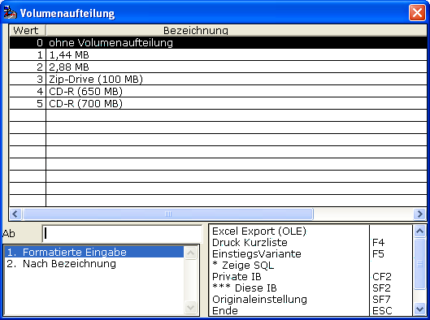

# Volumen

<!-- source: https://amic.de/hilfe/_volumen.htm -->

Bei Großen zu erwartendem Datenaufkommen können Sie die Menge der Dateien (Belege und Steuerdateien) aufteilen.

Sie finden dann nach dem Export im Export-Verzeichnis Unterordner 1, 2, 3, … und **dessen** Inhalt überschreitet nicht die in der Volumenaufteilung vorgegebene Maximalgröße.

Die AMICAR-Dateien sind dabei gepflegt. Eine Arbeit, die bei vielen Dateien unmöglich bis nicht rentabel erscheint.

Wenn Belege größer seien sollten, das die vorgegebene Maximalgröße, dann greift das Verfahren nicht. Diese Belege müssten Sie dann per Hand anpassen.
