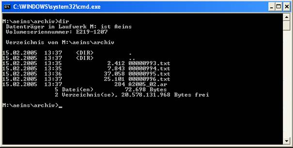

# Abgrenzung des Archives

<!-- source: https://amic.de/hilfe/_abgrenzungdesarchive.htm -->

Die Archivierung ins Dateisystem bedient sich der sogenannten AMICAR-Methode. Dabei werden die Belege nach bestimmten Namenskonventionen ins Dateisystem abgelegt und eine dazugehörige Steuerdatei abgelegt.

Beispiel:

Die Txt-Dateien enthalten jeweils die textuelle Darstellung der Belege, in der AR-Datei liegen die Steuerinformationen der Belege. Dabei wird pro Wirtschaftsjahr und Periode immer eine neue AR-Datei angelegt. Würde keine Abgrenzung aktiv sein, dann würden die AR-Dateien strikt nach Jahr und Monat benannt werden.
