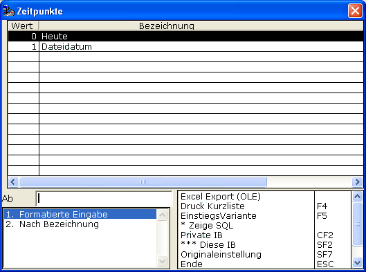

# Archiv/Druck-Datum

<!-- source: https://amic.de/hilfe/_archivdruckdatum.htm -->

Mit den Möglichkeiten

bestimmen Sie das Archiv/Druck-Datum des zu importierenden Beleges.

Mit den Auswahl-Möglichkeiten wird den Umständen Rechnung getragen, dass sich zum einem das Archiv/Druck-Datum generell aus dem Datei-Alter ergibt, oder eben dass eine Richtlinie existiert, nach der die importierten Belege eben das Datum zum Zeitpunkt des Imports tragen sollen.
