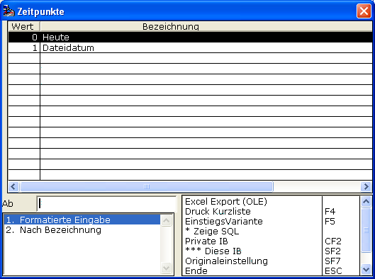

# Beleg-Datum

<!-- source: https://amic.de/hilfe/_belegdatum.htm -->

Mit dieser Einstellmöglichkeit wird durch die Auswahl

analog dem Archiv/Druckdatum bestimmt, welches Belegdatum die importierten Dateien tragen sollen.
