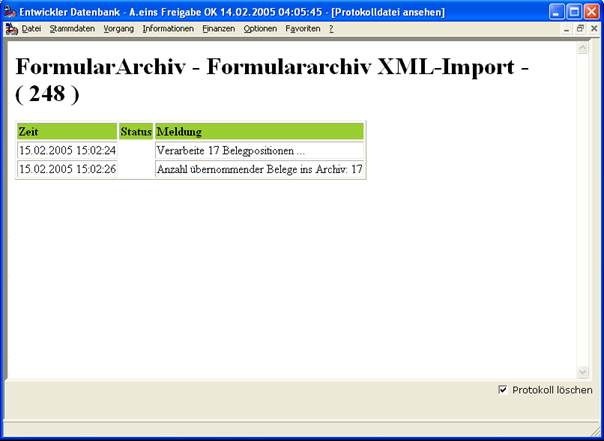
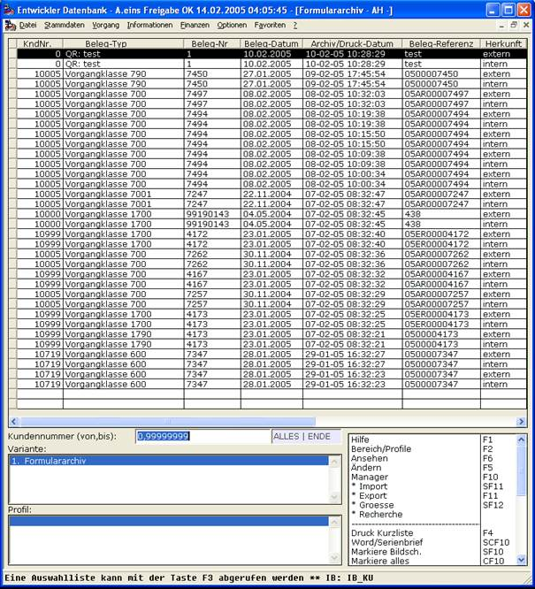

# Protokolleinrichtung im Archivimport

<!-- source: https://amic.de/hilfe/_protokolleinrichtung.htm -->

Erzeugt Tätigkeitsberichte.

Möchte man die eben exportierten Belege wieder importieren, dann stelle man als Import-Verzeichnis „..\\export“ ein und im Gegensatz zum Export erscheint aus historischen Gründen keine vorherige Sicherheits-Abfrage und es erscheint nach kurzer Zeit der folgende Tätigkeitsbericht.

Wie man unschwer erkennt, sind die Belege nun auch erwartungsgemäß doppelt im Formulararchiv.

Einzig die Herkunft verrät bei diesen Belegen ihre Herkunft aus externen Quellen; gemeint ist dann der Import.
