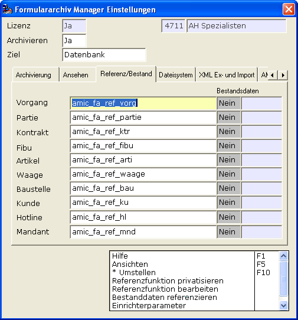
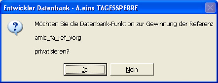
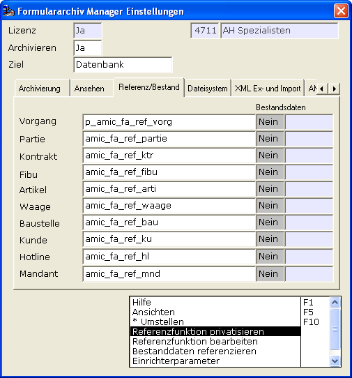
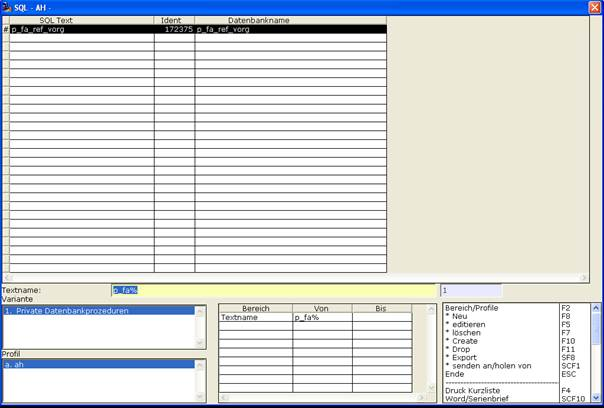

# Automatische Privatisierung der Datenbank-Funktion

<!-- source: https://amic.de/hilfe/_automatischeprivatis.htm -->

Der manuelle Vorgang eine private SQL-Funktion zu erstellen ist mühselig. Es gibt deshalb die Möglichkeit diesen Vorgang per Funktion „Referenzfunktion privatisieren“ zu automatisieren.

Für obiges Beispiel bedeutet dies

Damit ist automatisch eine private Kopie der ursprünglichen Datenbank-Funktion angelegt worden. Diese kann nun per „Referenzfunktion bearbeiten“ inhaltlich überarbeitet werden:

