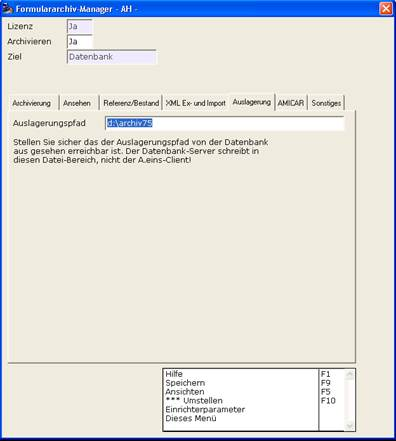

# Die Einrichtung

<!-- source: https://amic.de/hilfe/_dieeinrichtung.htm -->

Das Auslagerungssystem benötigt einen Dateibereich (einen Pfad), in dem es ausgelagerte Archivinhalte ablegen kann. Dieser Auslagerungspfad muss im Formulararchiv-Manager eingerichtet werden.

Beim „Auslagerungspfad“ ist durch die System-Administration sicherzustellen, dass der Pfad auch durch den Datenbank-Server erreichbar ist. In aller Regel werden hier „lokale“ Pfade des Datenbank-Servers eingetragen werden. Beachten Sie, dass der Datenbank-Server in sehr vielen Fällen als Windows-Service aktiv ist und Netzwerkzugriff für diesen Service von der System-Administration gewährleistet werden muss. Eine Lösung wäre eventuell – sofern nicht vorhanden – einen dedizierten User mit entsprechenden Rechten im Windows-System anzulegen und den Datenbank-Service dessen Identität annehmen zu lassen.
