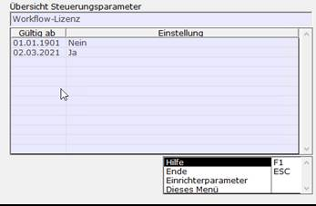
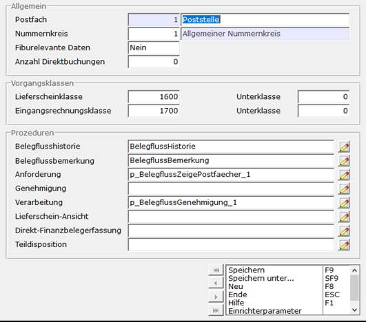

# Schritt 1 Setup

<!-- source: https://amic.de/hilfe/_sfsbelegfluss1.htm -->

Schritt 1.1: Voraussetzung

Das Belegfluss Modul basiert auf der Technologie unseres A.eins Archives. Dem entsprechend muss sowohl eine Lizenz für das A.eins Archiv, als auch dem Belegfluss vorliegen.

Schritt 1.2: SPA aktivieren

Workflow-Lizenz (SPA 1098) auf „ja“ setzten

Schritt 1.3: Postfächer einrichten

Zum Einrichten der Postfächer ist es nötig unter dem Direktsprung [BF] und dort unter der Variante 4 (Postfach-Einrichtung), Postfächer einzurichten (F5).

Hier sind bereits private Prozeduren hinterlegt. Die Beispiele werden in [Schritt 3](./schritt_3_einrichtung_fallbeispiel.md) näher erläutert.

