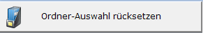

# Dokumentenverwaltung- Ordner

<!-- source: https://amic.de/hilfe/dokumentenverwaltungordner.htm -->

Unter der Rubrik „Ordner“ befinden sich die „Archiv-Belegklassen“ wiederum jeweils unterteilt nach „Archiv-Klassifizierungen“.

Durch Aktivierung einer Belegklasse werden nun die Daten neu geladen - unter der Einschränkung dass es sich dabei nur um solche handelt die das Kriterium der Belegklasse erfüllen.

Somit es schnell und einfach möglich bestimmte Belegklassen zu recherchieren.

Das funktioniert ganz genauso mit einer unterhalb einer Belegklasse ausgewählten Klassifizierung. Die automatische Eingrenzung berücksichtigt dann Belegklasse UND Klassifizierung.

Dass eine Ordner-Eingrenzung „aktiv“ ist wird in der [Dokumentenverwaltung- Statuszeile](./dokumentenverwaltung_statuszeile.md) signalisiert.

Ordner-Eingrenzungen werden nicht sitzungsübergreifend gespeichert. Wird die Dokumentenverwaltung beendet, werden die Selektionen zurückgesetzt.

Mittels  lässt sich die Ordner-Auswahl rücksetzen.
