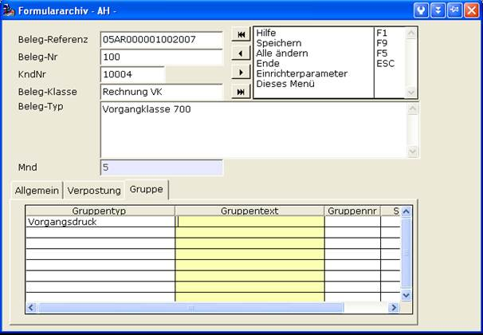
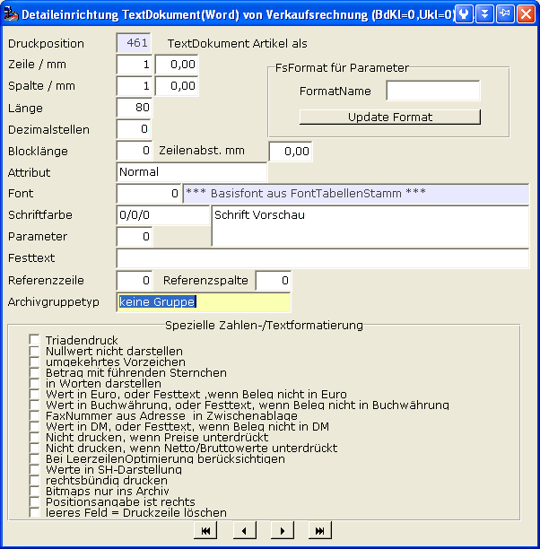

# Formulararchiv-Gruppen

<!-- source: https://amic.de/hilfe/_formulararchivgruppe1.htm -->

Das Archiv ist um die Möglichkeit der Gruppierung erweitert worden. Es können jetzt Archivelemente in einer Gruppe zusammengefasst werden; diese Gruppe trägt eine Gruppennummer sowie zwei weitere Kennzeichen. Das erste Kennzeichen steuert die Priorität des Beleges innerhalb dieser Gruppe (Typ Zahl), das zweite Kennzeichen steuert eine Linie innerhalb dieser Gruppe (Typ Zeichenkette).

Beispiel: Alle Belege einer Streckenverarbeitung besitzen eine Streckennummer, diese Streckennummer ist die Gruppe. Innerhalb der Strecke gibt es gewisse Zusammenhänge zwischen Belegen, wie z.B. der Lieferschein 1000 mit seinem Touravis, dem Frachtpapier und dem Zolldokument. Der Zusammenhalt dieser Belege wird über das Linienkennzeichen festgehalten. Des Weiteren ist nun innerhalb so einer Linie ein Beleg als der führende Beleg ausgezeichnet, dieser bekommt dann das Prioritätskennzeichen 1, alle anderen z.B. 2. Wird nun die Linie Lieferschein mit Frachtbrief, Zollschein und Touravis in die Poststraße gegeben, so wird in der Poststraße auf Basis des Prioritätskennzeichens eingetütet, damit das Anschriftenfeld auch immer richtig als erste Seite erscheint.

Die Gruppe ist zu jedem Archiv-Eintrag manuell pflegbar.

Der Gruppentyp ist ein Anwenderformat (AF_FA_GRUPPE) und ist als solches frei bestimmbar. Wir liefern eine Beispielkonfiguration aus. Wichtig ist zu bedenken, dass der Eintrag 0 des Formates dem Programm vorbehalten ist und die Bedeutung „keine Archivgruppe“ hat.

Im Vorgangsdruck ist eine Steuerung von Archiv-Dokumenten zu einem Artikel über einen angebaren Gruppentyp im Formular möglich.

