# Archivdatenbank Extern einrichten

<!-- source: https://amic.de/hilfe/_archivdatenbankexter.htm -->

Archivdatenbank Extern:

1. Kleine A.eins Datenbank (Basis) als Archiv.db mit Archiv.log bereitstellen (dblog –t archiv.log ..\\daten\\archiv.db)

2. Service erweitern, im Parameter die Archiv.db -n archiv hinzufügen

3. Odbc aufrufen und ODBC Verbindung unter System auf diese Datenbank wie auch die laufende Datenbank anlegen (ODBC Name Archiv und testen!!)

Achtung bei 64 bit bitte zunächst die 64 bit Treiber einrichten.

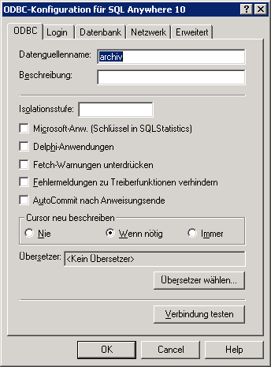

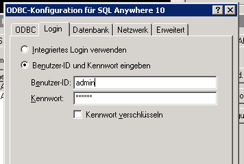

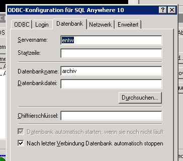

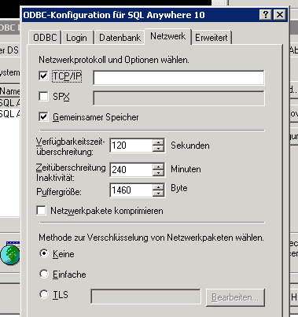

Scview Aufrufen und Datenbank wie auch Archivdatenbank öffnen

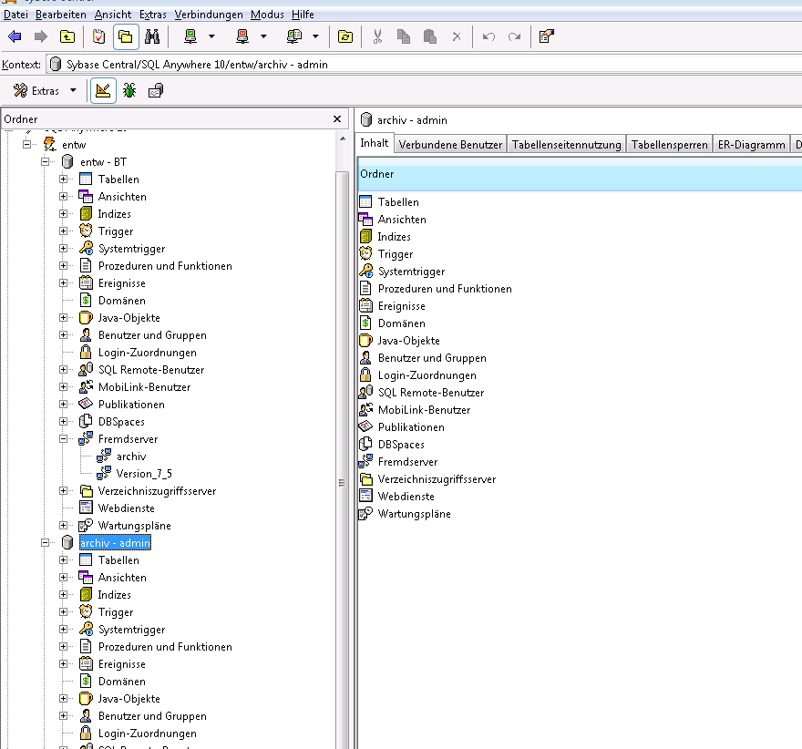

Erfasster Bildschirmausschnitt: 03.03.2009; 11:41

Jetzt bitte in der Archivdatenbank einen Fremdserveranschluss an die aktuelle Datenbank einrichten (dieser wird nur temporär genutzt für den Datentransfer.

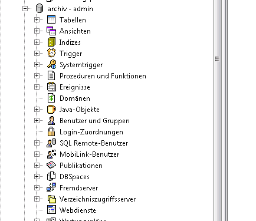

Rechte Maustaste auf Fremdserver und dann Neu.

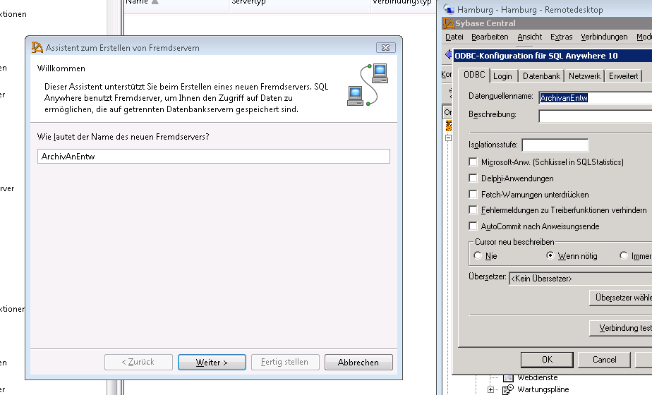

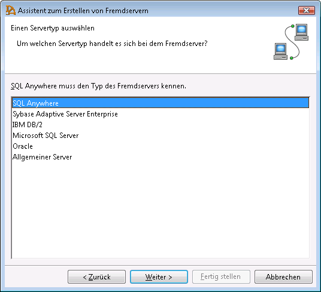

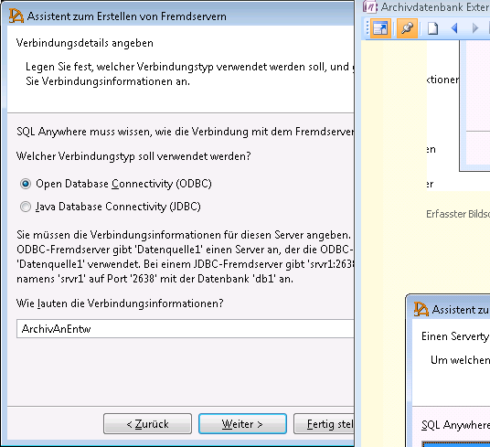

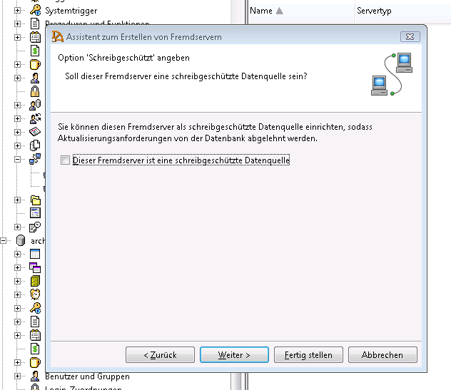

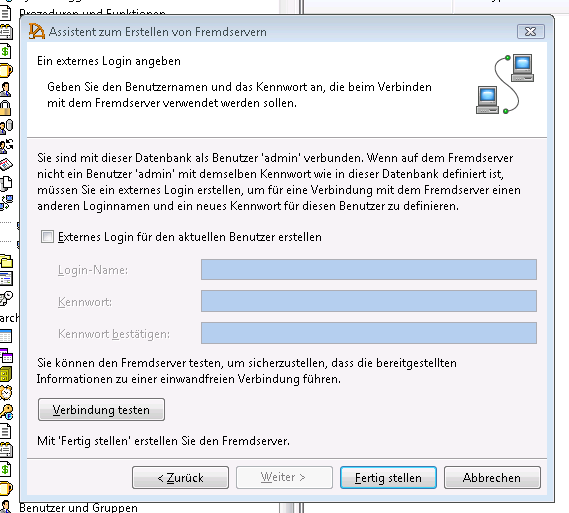

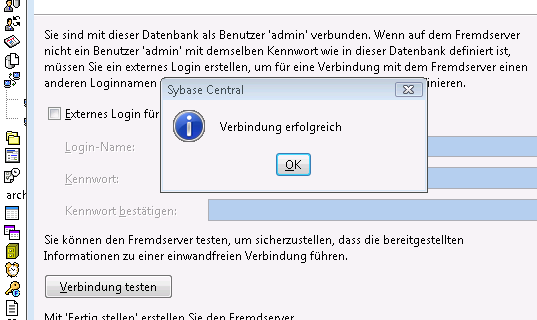

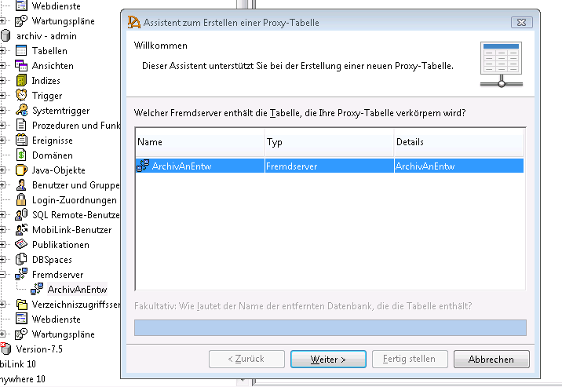

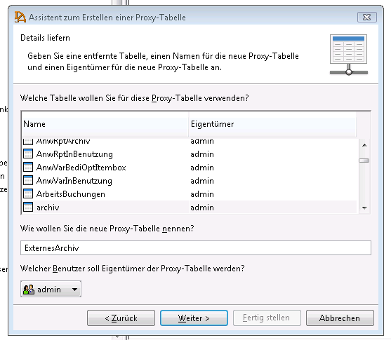 

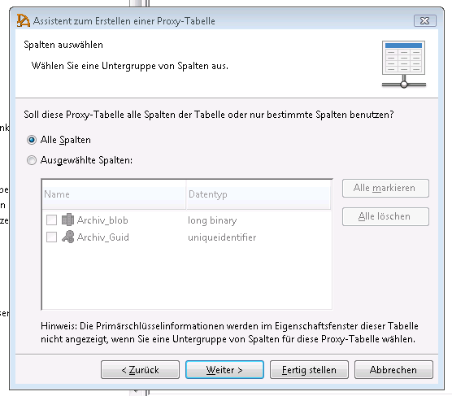

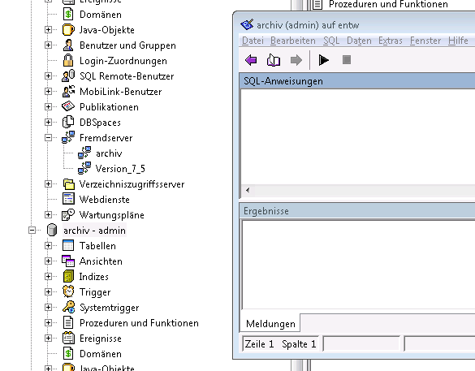

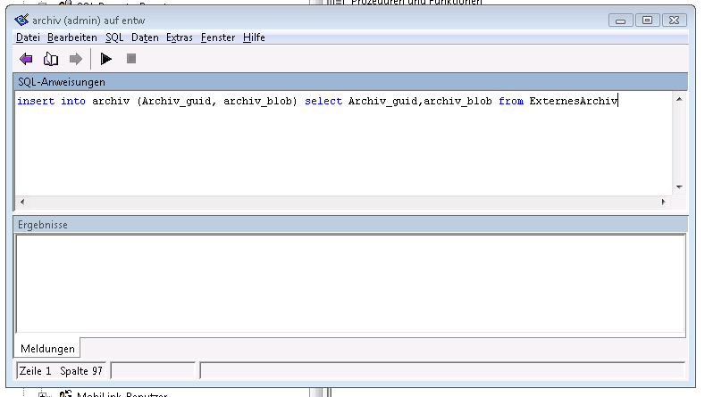 

Zum Schluss mit Commit und dann Exit abschließen  
Jetzt im Archivserver den Fremdserver wieder entfernen (rechte Maustaste auf proxytabelle und löschen und dann rechte Maustaste auf Server und löschen.)

Danach in der aktuellen Datenbank die Tabelle Archiv komplett löschen

Tabelle auswählen, Archiv suchen, rechte Maustaste und Löschen.

Dann das ganze umgekehrt, in der aktuellen Datenbank einen Proxyserver anlegen (wie oben) mit dem Namen Archiv, dann die Tabelle Archiv unter dem Namen Archiv einbinden.

Im Bedienerstamm noch kurz die Rechte für alle Bediener auf das Fremdarchiv aktivieren.

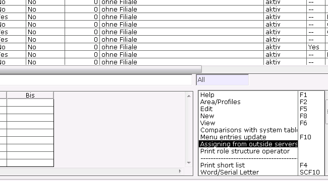 

FERTIG

Siehe auch:

- [Interne und externe Anbindung des Imports](./interne_und_externe_anbindung_des_imports/index.md)
- [Proxy-Tabelle](./proxy_tabelle.md)
- [Externe Relation Formulararchiv abbauen](./externe_relation_formulararchiv_abbauen.md)
- [Externe Relation Archiv erstellen](./externe_relation_archiv_erstellen.md)
- [Wissenswertes zur Auswahlbox](./wissenswertes_zur_auswahlbox.md)
- [DSO](./dso.md)
- [Hinzufügen (Archiv)](./hinzufuegen_archiv.md)
- [Relation Formulararchivimport](./relation_formulararchivimport.md)
- [Archiv Fakt-Tabellen](./archiv_fakt_tabellen.md)
