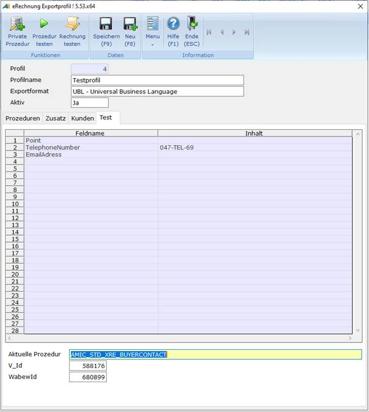

# Oberfläche - Test

<!-- source: https://amic.de/hilfe/oberflchetest.htm -->

Die Registerkarte ***Test*** steht nur im Modus **Ändern** zur Verfügung.

Hier können die Ergebnisse eingesehen werden, welche bei der Funktion ***Prozedur testen*** gesammelt werden.

Auf dem Register ***Test*** sind folgende Felder zu sehen:

  <table>
    <tbody>
      <tr>
        <td colspan="2">
          
<strong>Felder</strong>

        </td>
      </tr>
      <tr>
        <td>
          
<strong><em>Feldname</em></strong>

        </td>
        <td>
          
Der Feldname, des in der Prozedur befüllten Feld

        </td>
      </tr>
      <tr>
        <td>
          
<strong><em>Inhalt</em></strong>

        </td>
        <td>
          
Der Inhalt des entsprechenden Feldes

        </td>
      </tr>
      <tr>
        <td>
          
<strong><em>Aktuelle Prozedur</em></strong>

        </td>
        <td>
          
Die getestete Prozedur

        </td>
      </tr>
      <tr>
        <td>
          
<strong><em>Vorgangs Id</em></strong>

        </td>
        <td>
          
Die Id eines Vorgangs, auf welcher die Prozedur angewendet werden soll.

        </td>
      </tr>
      <tr>
        <td>
          
<strong><em>Wabew Id</em></strong>

        </td>
        <td>
          
Die id einer Warenbewegung, auf welcher die Prozedur angewendet werden soll

        </td>
      </tr>
    </tbody>
  </table>

