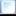
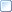
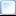

# Individualisierung

<!-- source: https://amic.de/hilfe/_terres_belegimport_indivi.htm -->

#### Belege erzeugen

Zum individualisieren der Belegerzeugung können am Steuerparameter „[829](../../../firmenstamm/steuerparameter/optionen_warenwirtschaft/belegimport_spa_829.md)“ Makros hinterlegt werden. Diese werden zu den angegebenen Zeiten aufgerufen.

Die Makros werden mit 4 Übergabeparametern aufgerufen.

<div class="table-wrapper">
  <table>
    <tbody>
      <tr>
        <td>
          <p><strong>&nbsp; Parameter</strong></p>
        </td>
        <td>
          <p><strong>&nbsp; Beschreibung</strong></p>
        </td>
      </tr>
      <tr>
        <td>
          <p>&nbsp;&nbsp; PARAM1</p>
        </td>
        <td>
          <p>&nbsp;&nbsp; Dieser Parameter enthält den Modus, durch welchen das Makro aufgerufen wurde. Mögliche Werte stehen in der folgenden Tabelle.</p>
          
          <table>
            <tbody>
              <tr>
                <th><strong>Makrotyp</strong></th>
                <th><strong>Wert</strong></th>
              </tr>
              <tr>
                <td>MAKRO_KOPF_START</td>
                <td>KOPFSTART</td>
              </tr>
              <tr>
                <td>MAKRO_KOPF_ENDE</td>
                <td>KOPFENDE</td>
              </tr>
              <tr>
                <td>MAKRO_POSI_START</td>
                <td>POSISTART</td>
              </tr>
              <tr>
                <td>MAKRO_POSI_ZWISCHEN</td>
                <td>POSIZWISCHEN</td>
              </tr>
              <tr>
                <td>MAKRO_POSI_ENDE</td>
                <td>POSIENDE</td>
              </tr>
              <tr>
                <td>MAKRO_BELEG_SPEICHERN</td>
                <td>BELEGSPEICHERN</td>
              </tr>
            </tbody>
          </table>
          
        </td>
      </tr>
      <tr>
        <td>
          <p>&nbsp;&nbsp; PARAM2</p>
        </td>
        <td>
          <p>&nbsp;&nbsp; Dieser Parameter enthält den Namen des aktuellen „Vorgangshelper“ JPP-Objekts.</p>
        </td>
      </tr>
      <tr>
        <td>
          <p>&nbsp;&nbsp; PARAM3</p>
        </td>
        <td>
          <p>&nbsp;&nbsp; Dieser Parameter enthält den JVARS-Owner in dem die Vorgangskopfdaten liegen.</p>
        </td>
      </tr>
      <tr>
        <td>
          <p>&nbsp;&nbsp; PARAM4</p>
        </td>
        <td>
          <p>&nbsp;&nbsp; Dieser Parameter enthält den JVARS-Owner in dem die Positionsdaten der aktuellen Position liegen.</p>
        </td>
      </tr>
    </tbody>
  </table>
</div>

Die Daten für den Vorgang und die Positionen werden in JVARS zwischengespeichert. Diese können im Makro über den entsprechenden JVARS-Owner ausgelesen und geändert werden. Alternativ können über den Namen des Vorgangshelper-Objekts eigene JPP-Funktionen aufgerufen werden, um die Verarbeitung zu beeinflussen.

### Vorgangskopf JVARS

|  JVAR Name |  Beschreibung |
| --- | --- |
|  VALUE_ID |  ID des Beleges. Anhand dieser Nummer kann auf die XML-Daten zugegriffen werden. |
|  VALUE_KundenNummer |  Nummer des Kunden |
|  VALUE_Klasse |  Klasse des Beleges |
|  VALUE_Unterklasse |  Unterklasse des Beleges |
|  VALUE_LagerNummer |  Nummer des Lagers |
|  VALUE_IstGutschrift |  Wenn ist im Originalbeleg die Summe negativ, steht dieser Wert auf 1 und die Klasse auf 1800. |
|  VALUE_BelegNummer |  Belegnummer des Ursprungsbelegs. Dieser Wert wird in die Referenznummer geschrieben. |
|  VALUE_Periode |  Periode des Belegs |
|  VALUE_BelegDatum |  Datum des Belegs |
|  VALUE_Jahr |  Jahr des Belegs |
|  VALUE_ValutaDatum |  Valutatdatum des Belegs |

### Position JVARS

|  JVAR Name |  Beschreibung |
| --- | --- |
|  VALUE_PosZuAb |  Zu/Abschlagskennzeichen *(wird nicht verwendet)* |
|  VALUE_Menge |  Menge der Position |
|  VALUE_Betrag |  Betrag der Position |
|  VALUE_ArtikelNr |  Artikelnummer der Position |
|  VALUE_PosAnlegen |  Diese JVAR steht im Standard immer auf 1. Soll die folgende Position in dem Beleg nicht angelegt werden, so muss die JVAR auf 0 gesetzt werden. |

#### Belegimport

Der normale Belegimport importiert die Daten aus dem im Steuerparameter „[829](../../../firmenstamm/steuerparameter/optionen_warenwirtschaft/belegimport_spa_829.md)“ hinterlegten Pfad. Dort kann jedoch auch eine individuelle Prozedur hinterlegt werden, in der man einen eigenen Import starten kann.

Mit der folgenden Prozedur kann man eine Datei direkt ins Formulararchiv und die entsprechenden Tabellen laden. Die Datei wird dabei nicht umbenannt, das muss die private Prozedur selber machen.

```sql
Select terresImportBeleg('\\\\NetzwerkPfad\\temp\\test.xml')
```

#### Kontrollmakro

Für den Belegimport wurde ein Kontrollmakro „TERRES_ER_Kontrollmakro“ hinterlegt welches das Fibu Sperrkennzeichen setzt, wenn die Summe des Terresbeleges sich von der Summer des A.eins Beleges unterscheidet. In dem Beispiel wird das Makro nach dem Speichern des A.eins Beleges aufgerufen. In dem Beispiel darf es nur eine Rundungsdiffernz von 0.05 Euro geben.

Damit beim Aufruf des Makros bestimmt werden kann, ob es sich um eine A.eins Eingansgrechnung handelt, die aus einem Terresbeleg erzeugt wird, wird die JAVR "TERRESBELEG" gestzt. Der Owner für die JAVR ist im BAG "TERRESBELEGIDENT" gespeichert. Ist der Inhalt der JVAR eine 1, so handelt es sich um eine A.eins Eingangsrechnung welche aus einer Terresrechnung erzeugt wird. Die JAVR und der BAG werden nach dem beenden des Beleges gelöscht.
