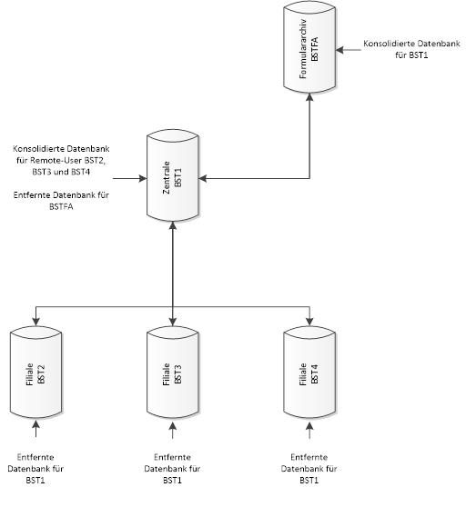

# Externes Formulararchiv

<!-- source: https://amic.de/hilfe/_ExternesFormulararchiv.htm -->

Wird das Formulararchiv z.B. Neben dem Archiv auch extern verwaltet so lässt sich die Replikation relativ einfach für alle Beteiligten synchron halten.

Das folgende Bild veranschaulicht die hierfür nötigen Einrichtungsschritte:

Hier ist die Datenbank, in der die Tabelle Formulararchiv liegt und verwaltet wird, für die Zentrale eine konsolidierte, also **übergeordnete** Datenbank.

Die Zentrale ist wie bisher die konsolidierte, also übergeordnete Datenbank für die Filialen BST2, BST3 und BST4.

In diesem Beispiel nutzen wir die Möglichkeit, dass Artikel in den Publikationen durchaus mehrfach vorkommen können. Hier nun wird in der Zentrale eine weitere Publikation mit dem Artikel (Tabelle) Formulararchiv angelegt und für den Subskribenten BSTFA gestartet. Dieser muss natürlich zunächst als SQL Remote Benutzer mit Nachrichtensystem „File“ in der Zentrale angelegt werden.

Die Tabelle Formulararchiv ist weiterhin in einer der Standardpublikationen enthalten und wird subskribiert für BST2, BST3 und BST4. Welches ja die entfernten SQL Remote Benutzer der Zentrale sind.

In der der Zentrale übergeordneten Formulararchiv-Datenbank wird ebenfalls eine Publikation mit dem Artikel Formulararchiv erstellt und für BST1 (Zentrale) subskribiert. Der Publisher ist hier BSTFA, und auch hier muss ein SQL Remote Benutzer BST1 mit Nachrichtensystem „File“ angelegt werden.

Durch die Replikation der Daten der Tabelle Formulararchiv sind diese in allen Datenbanken synchron.

*HINWEIS:*

*Dies ist natürlich nicht nur mit dem Formulararchiv möglich, sondern mit jeder gewünschten Tabelle.*
