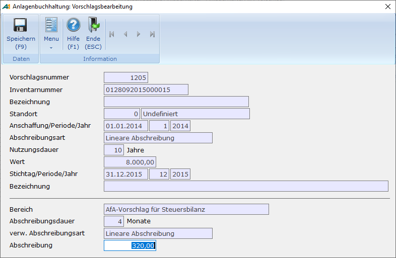
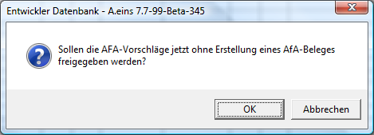
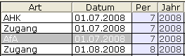

# Abschreibung

<!-- source: https://amic.de/hilfe/_abschreibung.htm -->

Hauptmenü > Anlagenbuchhaltung > Anlagenbuchhaltung > AfA-Vorschlag erstellen

Direktsprung **[ANKAV]**

Abschreibungen werden in einem Stapellauf erstellt und zuerst in eine vorläufige Liste gestellt. Diese Vorschläge können dann in der Anwendung „AfA-Vorschlag bearbeiten“ (Direktsprung **[ANKAB]**) kontrolliert und geändert werden, bevor man sie endgültig freigibt.

Beim Errechnen der Abschreibung gibt es eine Besonderheit bei nachträglichen Anschaffungs- und Herstellungskosten (Zugängen bzw. Teilabgängen). Die sich aus diesen ergebende neue Bemessungsgrundlage wird auf die Restnutzungsdauer verteilt, d.h. die Abschreibung wird anteilig mit der alten Bemessungsgrundlage bis zum Zu- bzw. Teilabgang errechnet. Es gibt jedoch auch die Möglichkeit aus Vereinfachungsgründen diese Kosten so zu berücksichtigen, als seien sie zu Beginn des Jahres entstanden (R 7.4 Abs. 9 Satz3 EStR). Dies lässt sich durch die Option „Vereinfachungsregel bei Zu- und Abgängen anwenden“ im [Firmenstamm](./einstellungen_anlagenbuchhaltung.md) einstellen.

Bevor man die Vorschläge erstellt, werden folgende Daten abgefragt:

| | Bedeutung |
| --- | --- |
| Bereich | Da im Zuge von BilMoG eine Trennung nach Handels- und Steuerrecht möglich ist, kann man auch die Abschreibungsvorschläge getrennt erstellen.  |
| Stichtag | Er wird mit dem aktuellen Tagesdatum vorbelegt und beim Buchen der Abschreibung als Belegdatum herangezogen.  |
| Bis Periode/Jahr | Die Werte werden an Hand des Stichtages vorbelegt. Sie dienen zur Abgrenzung des Abschreibungsintervalls. Stichtag, Periode und Jahr werden in die Anlagenposition übernommen. Es wird daher geprüft, ob das Datum innerhalb der Periode liegt und ggf. die Hinweismeldung „Das Datum 26.03.2008 und die Periode 2/2008 passen nicht zusammen!“ ausgegeben.  |
| Bezeichnung | Dieser Text dient zur Identifikation. Er wird später beim Buchen des Vorschlags als Text in das Protokoll der Veränderungen des Anlagegutes übernommen.  |
| Inventarnummer | Gibt man hier etwas ein, so werden nur für die Anlagegüter AfA-Vorschläge erstellt, die dieser Inventarnummer entsprechen. Intern erfolgt die Auswahl mit dem SQL-Befehl „like“. Das hat den Vorteil, dass man so – bei entsprechender Vergabe der Inventarnummer – eine Gruppe von Anlagegütern verarbeiten kann. Man gibt z.B. nur die ersten Stellen der Inventarnummer gefolgt von einem Prozentzeichen an. Dadurch weiß das System, dass alle so beginnenden Anlagegüter verarbeitet werden sollen. Lässt man das Prozentzeichen weg, wird nach genau dieser Nummer gesucht. Lässt man das Feld leer, werden alle Anlagegüter verarbeitet.  |

Nachdem man diesen Vorgang mit **F9** gestartet hat, werden im unteren Bereich der Abfragemaske die gerade bearbeiteten Anlagegüter angezeigt. Wenn noch AfA-Vorschläge existieren, die noch nicht freigegeben wurden, so erscheint die Meldung:

„Es existiert noch ein nicht abgearbeiteter Abschreibungsvorschlag.“

Es ist dann nicht möglich einen weiteren Lauf durchzuführen. Dieses Verhalten lässt sich durch die Option „Vorschläge nur erstellen, wenn keine unbearbeiteten Vorschläge existieren“ im [Firmenstamm](./einstellungen_anlagenbuchhaltung.md) abstellen. Es werden dann trotzdem nur für die Anlagengüter Vorschläge erstellt, bei denen noch keine Vorschläge existieren. Dies ist auch unabhängig von der Periode.

Beim Erstellen der Abschreibungsvorschläge wird vorher geprüft, ob ggf. die Dauer 12 Perioden überschritten wurde. Es wird dann für dieses Anlagegut eine Fehlermeldung ausgegeben und kein Vorschlag erstellt. Wird ein Intervall größere als ein Wirtschaftsjahr gewählt, so werden mehrere Vorschläge – jeweils bis zum Ende des Wirtschaftsjahres – gebildet.

Anlagegüter, die Verkauft wurden, werden je nach Einstellung des Schalters „Sonstige betriebliche Erträge/Aufwendungen führen“ im [Firmenstamm](./einstellungen_anlagenbuchhaltung.md) unterschiedlich behandelt. Steht dieser Schalter auf Nein, so werden keine Vorschläge mehr gerechnet, ansonsten werden die Vorschläge noch erstellt, wenn noch keine Erträge/Aufwendungen erfasst wurden. Bei GWGs werden keine Vorschläge erstellt, wenn nach dem Abgang/Verkauf der Wert des GWGs 0.0 ist, unabhängig von der Einstellung.

Wurde für alle anstehenden Güter die Abschreibung errechnet, erscheint entweder die Meldung „Funktion beendet“ oder eine Liste mit den aufgetretenen Problemen.

Es können pro Anlagegut ein oder mehrere Vorschlagszeilen existieren. Mehrere Zeilen existieren dann, wenn seit dem letzten Abrechnungszeitraum Bewegungen wie Zu- oder Abgänge hinzugekommen sind und diese Zeitgenau berücksichtig werden, also der Einrichterparameter „Vereinfachungsregel bei Zu- und Abgängen anwenden“ auf „Nein“ steht. Auch wenn man die Abschreibung für mehrere Jahre errechnen lässt, wird pro Wirtschaftsjahr eine Vorschlagszeile gebildet.

Die so entstandenen Vorschläge lassen sich unter

Hauptmenü > Anlagenbuchhaltung > Anlagenbuchhaltung > AfA-Vorschlag

(Direktsprung **[ANKAB]**) weiter bearbeiten. Dort stehen die Funktionen:

- Löschen
- Alle Löschen
- Ändern
- Ansehen
- Freigabe

zur Verfügung.

„Löschen“ löscht den bzw. die markierten Datensätze. Existieren zu einem Anlagegut mehrere Vorschlagszeilen, so werden diese gemeinsam gelöscht. Die Funktion „Alle Löschen“ löscht sämtliche Vorschläge, unabhängig von der getroffenen Eingrenzung in der Auswahlliste.

Bei der Funktion Ändern - bzw. Ansehen – öffnet sich folgender Bildschirm:

Im oberen Teil werden Informationen zum Anlagegut angezeigt. Bewegungen, die bisher bei diesem Anlagegut aufgetreten sind, kann man sich sofort über die Funktion „Anlagegut anzeigen“ F6 ansehen. Es erscheint dann der bekannte Bildschirm der [Anlagenbuchhaltung](./anlagenstamm.md). Dort erscheint dieser Vorschlag übrigens bereits in der Historie unter der Art „Vorschl“.

Wenn man den Vorschlag bearbeitet, kann man lediglich den Betrag ändern. Im Feld über dem Betrag steht noch die Anzahl Monate, für die die Abschreibung berechnet wurde. Neben „verw.Abschreibung“ steht die Abschreibungsmethode, mit der der Betrag errechnet wurde. Diese weicht nur bei Degressiv/Linearer Abschreibung von der im Anlagenstamm hinterlegten Abschreibung ab.

Bei der Eingabe der Abschreibung wird geprüft, ob der Anhaltewert(s.o.) nicht unterschritten wird.

#### Freigabe

Hat man alle Vorschläge kontrolliert, werden sie über die Funktion ***Freigabe/Eintrag Primanota*** **F9** in eine Abschreibung umgewandelt. Bei der Umwandlung werden alle Anlagegüter, die den Anhaltewert erreicht haben als vollständig abgeschrieben gekennzeichnet. Gleichzeitig werden Sammelbelege mit den eingerichteten Anlagen/AfA-Konten bzw. den [Kostenstellen](../kostenrechnung/kostenstellen.md), [Kostenträgern](../kostenrechnung/kostentraeger.md) und [Kostenobjekten](../kostenrechnung/kostenobjekte/index.md) in der Finanzbuchhaltung erzeugt. Diese Belege werden je nach Einstellung im Firmenstamm für die steuerrechtlichen oder handelsrechtlichen Abschreibungen erzeugt. Es erfolgt dann eine Sammelbuchung, bei der die Positionen des Beleges pro Anlagenkonto, [Kostenstelle](../kostenrechnung/kostenstellen.md), [Kostenträger](../kostenrechnung/kostentraeger.md) und [Kostenobjekt](../kostenrechnung/kostenobjekte/index.md) gerafft werden. Der so entstandene Beleg kann dann in der Primanota bearbeitet werden.

Möchte man keine Belege in der Finanzbuchhaltung erzeugen, so steht hierfür ein Einrichterparameter zu Verfügung „KEINEN Beleg für die Primanota erzeugen?“. Stellt man diesen auf **Ja**, so erscheint dann in der Abfrage der Zusatz „ohne Erstellung eines AfA-Beleges“ und es werden keine Buchungen erzeugt. Diese müssen dann ggf. manuell erzeugt werden.

**ACHTUNG:**

*Wird der hier erstellte Beleg in der Primanota gelöscht, werden die AfA-Positionen in der Anlagenbuchhaltung nur dann gelöscht, wenn noch keine Folgezeilen in der Historie erfasst wurden.*

Man kann AfA-Zeile aber auch in der Anlagenbuchhaltung stornieren. Es wird dann ein entsprechender Stornobeleg erzeugt. Dafür steht in der Optionbox eines Anlagegutes (Direktsprung ANKAS) die Funktion „Letzte AfA stornieren“ zur Verfügung. AfA-Zeilen können nur storniert werden, wenn keine jüngere Zeile eines anderen Typs(Zugang/Teilabgang) existiert. Es wird immer die jüngste AfA-Zeile storniert. Stornierte Zeilen werden grau hinterlegt und nicht mehr in die Summe mit hineingerechnet.

Man kann diese grau hinterlegten Zeilen auch völlig ausblenden. Dazu dient der Einrichterparameter „Stornierte/gelöschte Zeilen anzeigen?“. Ändert man diesen auf „Nein“, wo werden die Zeilen auf der Erfassungsmaske nicht mehr angezeigt. Der Druck des Stammblattes bleibt von diesem Einrichterparameter unberührt.

Bei der Stornierung einer AfA-Zeile wird immer dann automatisch ein SO-Beleg erstellt, wenn auch für die AfA ein Eintrag in der Fibu existiert. Wurde der FIBU-Beleg zu dieser AfA-Zeile bereits gelöscht, so wird auch kein Stornobeleg erstellt. Nummernkreis, Belegdatum und Fälligkeit werden in einer separaten Maske abgefragt.
