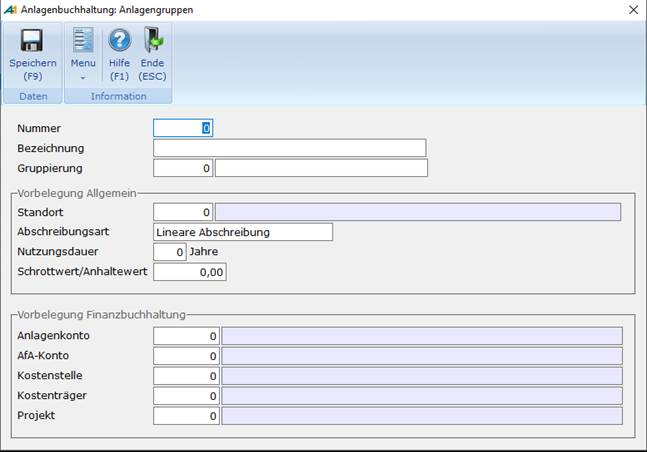

# Anlagengruppen

<!-- source: https://amic.de/hilfe/_anlagengruppen.htm -->

Hauptmenü > Anlagenbuchhaltung > Stammdaten > Anlagengruppen

Direktsprung **[ANKAG]**

Die einzelnen Gegenstände des Anlagevermögens können zu verschiedenen Gruppen zusammengestellt werden. Diese Gruppen können sich z.B. aus der Gliederung des Anlagevermögens in Sachanlagen, Finanzanlagen usw. oder nach anderen betrieblichen Gesichtspunkten ergeben.

Die Anlagengruppen können zur Eingrenzung und Sortierung in den Auswahllisten verwendet werden. Die **Gruppierung** dient dazu in den Reporten eine weitere Möglichkeit der Gliederung oberhalb der Anlagengruppe zu haben. Das Feld hinter der Nummer ist die Bezeichnung der Gruppierung und erscheint als Gruppenüberschrift in den Reporten. Hat man zu einer Gruppierung bereits einmal Bezeichnung hinterlegt, erscheint diese dann automatisch bei Wiederverwendung der Gruppierung. Die Reporte der Anlagenbuchhaltung bieten die Möglichkeit nach dem Anlagenkonto, Standort und Kostenstelle, Anlagengruppe mit Gruppierung oder nur nach der Anlagengruppe zu gruppieren.

Gleichzeitig dienen die Anlagengruppen als Eingabehilfe. Man kann jeder Anlagengruppe folgende Kriterien zuordnen:

- Standort
- Abschreibungsart
- AfA-Satz
- Nutzungsdauer
- Schrottwert
- Anlagekonto
- AfA-Konto
- [Kostenstelle](../kostenrechnung/kostenstellen.md)
- [Kostenträger](../kostenrechnung/kostentraeger.md)
- [Kostenobjekt](../kostenrechnung/kostenobjekte/index.md)

Wählt man dann bei der Neuerfassung von Anlagegütern eine Gruppe aus, werden die hier hinterlegten Werte als Vorbelegung herangezogen.
